**VizAlerts: Data Driven Alerting for Tableau**

# User Guide #

# Table of Contents
- [What is VizAlerts?](#what_is_vizalerts)
	- [What can VizAlerts do?](#what_can_vizalerts_do)
- [Changes in VizAlerts 2.1.0](#changes-in-vizalerts-2_1_0)
	- [Alert Criteria is a Calc](#alert_criteria_is_a_calc)
	- [Smart Notification Defaults](#smart_notification_defaults)
	- [Get alerts "when the extract refreshes"](#get_alerts_when_the_extract_refreshes)
	- [Multithreaded Notifications](#multithreaded_notifications)
	- [Python no longer required](#python_no_longer_required)
	- [Use the VizAlertsDemo workbook to build your alerts](#use_the_vizalertsdemo_workbook_to_build_your_alerts)
- [Upgrading from VizAlerts 2.0.x](#upgrading_from_vizalerts_2_0_x)
- [How do I use VizAlerts?](#how_do_i_use_vizalerts)
- [Simple Alerts](#simple_alerts)
- [Advanced Alerts](#advanced_alerts)
	- [Advanced Alert Fields](#advanced_alert_fields)
	- [Field Names Are Customizable](#field_names_are_customizable)
	- [Important Info About Advanced Alerts](#important_info_about_advanced_alerts)
	- [Advanced Alerts Walkthrough #1 – Send the Trigger Viz](#advanced_alerts_walkthrough__1_–_send_the_trigger_viz)
	- [Advanced Alerts Walkthrough #2 – Send a Custom Viz](#advanced_alerts_walkthrough__2_–_send_a_custom_viz)
- [Additional Advanced Alert Features](#additional_advanced_alert_features)
	- [Custom Body, Header, and Footer](#custom_body__header__and_footer)
	- [Content References](#content_references)
		- [Custom View References: Getting Almost Any View from Tableau Server](#custom_view_references__getting_almost_any_view_from_tableau_server)
		- [URL Parameters](#url_parameters)
		- [Custom Filenames for Appended Attachments: |filename](#custom_filenames_for_appended_attachments___filename)
		- [Hyperlink Text References: VIZ_LINK()](#hyperlink_text_references__viz_link__)
		- [Hyperlinked Inline Images: |vizlink](#hyperlinked_inline_images___vizlink)
		- [Merge Multiple PDFs : |mergepdf](#merge_multiple_pdfs____mergepdf)
	- [Appended (non-inline) Attachments](#appended__non-inline__attachments)
	- [Consolidated Alerts](#consolidated_alerts)
		- [Newlines and Line Breaks](#newlines_and_line_breaks)
		- [Sorting Consolidated Alerts](#sorting_consolidated_alerts)
		- [Headers and Footers in Consolidated Alerts](#headers_and_footers_in_consolidated_alerts)
	- [Merged PDFs](#merged_pdfs)
- [SMS Text Message Alerts](#sms_text_message_alerts)
	- [SMS Alert Configuration](#sms_alert_configuration)
	- [Supported Mobile Number Formats](#supported_mobile_number_formats)
	- [Important Info about SMS Advanced Alerts](#important_info_about_sms_advanced_alerts)
	- [Content References for SMS Advanced Alerts](#content_references_for_sms_advanced_alerts)
- [Advanced Alert Use Cases](#advanced_alert_use_cases)
	- [Tableau Server Monitoring](#tableau_server_monitoring)
	- [Extract Failure to Refresh Notifications](#extract_failure_to_refresh_notifications)
	- [Bulk Mailing](#bulk_mailing)
	- [Consolidated Emails](#consolidated_emails)
	- [Dashboard with Hidden Embedded Alert](#dashboard_with_hidden_embedded_alert)
- [Testing an Alert](#testing_an_alert)
- [FAQ / Common Issues / Troubleshooting](#faq___common_issues___troubleshooting)
	- [I got a failure email instead of an alert!](#i_got_a_failure_email_instead_of_an_alert_)
	- [I’m getting Simple Alerts when I should be getting Email Advanced Alerts.](#i_m_getting_simple_alerts_when_i_should_be_getting_email_advanced_alerts_)
	- [I’m getting Simple Alerts when I should be getting SMS Alerts](#i_m_getting_simple_alerts_when_i_should_be_getting_sms_alerts)
	- [What if I don’t get an alert email when I expect one?](#what_if_i_don_t_get_an_alert_email_when_i_expect_one)
	- [How can I avoid getting continual alerts for the same data?](#how_can_i_avoid_getting_continual_alerts_for_the_same_data)
	- [I’m getting my Alerts late.](#i_m_getting_my_alerts_late_)
	- [There is no default footer on my emails.](#there_is_no_default_footer_on_my_emails_)
	- [My CSV is Bad!](#my_csv_is_bad_)
		- [Wrong worksheet’s data](#wrong_worksheet_s_data)
		- [Wrong data structure](#wrong_data_structure)
	- [My Emails aren’t Consolidating.](#my_emails_aren_t_consolidating_)
	- [My PDFs aren’t Merging.](#my_pdfs_aren_t_merging_)
	- [Inline and/or Appended Attachments aren’t showing up in my email.](#inline_and_or_appended_attachments_aren_t_showing_up_in_my_email_)
- [Getting VizAlerts Help](#getting_vizalerts_help)
- [Contributing to VizAlerts](#contributing_to_vizalerts)

What is VizAlerts?
==================

Since the dawn of time, humans have brought up the needs that they have
for various forms of alerting driven by Tableau Server. Some want to
know when extract refreshes fail. Others want to know when they succeed.
Salespeople want to know when they hit their quota. Still others simply
want to make a few tweaks to the existing Subscription functionality,
say, by being able to send a report image to a distribution list that
includes recipients who aren’t on Tableau Server.

VizAlerts is an automation platform intended to seamlessly integrate
with Tableau Server. The idea behind it is that anyone should be able to
easily build, share, and customize pretty much any email, SMS, or
various other automation based on their own Tableau Server viz data.

What can VizAlerts do?
----------------------

VizAlerts has been designed to support many use cases:

-   Sending notifications to subscribers when a condition has been met
    (or not!) like extract refresh failures, meeting or missing target
    thresholds, etc.

-   Halting emails from being sent to the group unless the data is up to
    date (while the workbook owner does get an email that the data isn’t
    up to date).

-   Notify data owners when data is corrupt in some way (extraneous
    values, too many Null values, too large a change, etc.)

-   Sending a one line email notification that could be forwarded
    through an email-to-sms gateway such
    as \#\#\#\#\#\#\#\#@txt.att.net. (Or sending a
    multimedia notification!).

-   Batch reporting to distribution lists of non-Tableau users, for
    example emailing a weekly operations report to front-line staff who
    aren’t on Tableau.

-   Combining images and text into an HTML email for a more customized,
    professional look.

-   Merge multiple views into a single consolidated PDF, for example
    sending a company overview and per-region detail.

-   Blend views from separate workbooks in the same email, for example a
    view from the operations dashboard and a view from the
    finance dashboard.

<!-- -->

-   Bursting reports, for example sending to a manager a dashboard for
    each of her direct reports.

-   Send SMS messages to escalate an issue to your support staff.

<!-- -->

-   Whatever combinations of the above you can imagine!

Changes in VizAlerts 2.1.0 
=================

VizAlerts 2.1.0 (released August 2017) has the following major new and
changed features:

**Alert Criteria is a Calc** 

For both Email and SMS Actions, the "Action" flag field on either is now the condition being checked to determine 
if the action should be executed. This means that you no longer need to rely solely on filters to remove data 
that should not trigger the alert. Instead, you can build your own criteria in the Email Action and SMS Action flags 
as a calculation. A value of "1" signals that the action should be executed, whereas a 0 will cause no actions to be 
executed.

This is a great feature, because it means your vizzes can continue looking the way they normally do--all the non-alerting 
data can be kept, which provides visual context for your alerts! No more ugly blank vizzes! You can also move the 
Email Action field to the Color shelf to make it very clear which marks are triggering the alert, and which are not.

**Smart Notification Defaults** 

Another big change is that there are no "required" fields send email, anymore. All fields are optional. Don't want to 
customize the Subject? Leave "Email Subject" off viz entirely, and VizAlerts will automatically generate it. Don't want 
anything special in the Body? Leave that field off, and you'll automatically get the viz image with a hyperlink. Advanced 
Alerts are now more intuitive and flexible than ever. (Note that SMS messages still have required fields) 

**Get alerts "when the extract refreshes"** 

If you've wanted to run your VizAlerts when the extracts in the workbook they're a part of refresh, you've got your wish. 
The administrator may now set up two schedules; one for Refresh Success and one for Refresh Failure. Subscribe to either 
or both of those, and your VizAlert will run when the extract(s) in the workbook refresh.

**Multithreaded Notifications** 

Several folks have brought up that they've got VizAlerts that send hundreds of emails out at once. Previous versions 
took a while to do this, because each was running in a single thread. No more. Now, each VizAlert can send as many 
emails or SMS messages at the same time as the Admin will allow. (Note that content references are still processed 
one at a time, within a single VizAlert)

**Python no longer required** 

With help from another Tableau Dev who was generous with their time, we now have VizAlerts in .exe form, so if you don't 
want to use Python to run it, you don't need to (but you'll still have the option). 

**Use the VizAlertsDemo workbook to build your alerts** 

We took a lot of tips and tricks we've learned over the years building VizAlerts and integrated them into a VizAlertsStarter 
workbook, which replaces the published data source used previously. This workbook contains all the special fields that 
you'll need to build your alerts, with copious comments and examples in the calcs. It's also been updated to 
include the new Smart Defaults and conditional action flag features. 

Upgrading from VizAlerts 2.0.x
============================

All of the alerts you’ve built using VizAlerts 2.0.x should continue working 
once the VizAlerts administrator has configured VizAlerts 2.1.0. There are no changes required.
The admin side does have some changes--please see the VizAlerts Installation
Guide for those details.

How do I use VizAlerts? 
=======================

An alert is defined by two things: A view published to Tableau Server
(called the *trigger view*), and a subscription to that view on a
special, *disabled* Subscription schedule. Let’s take a look at a simple
example (you can follow along yourself if you publish the included
\[VizAlerts install folder\]\\demo\\VizAlertsDemo.twb file to your
Tableau Server):

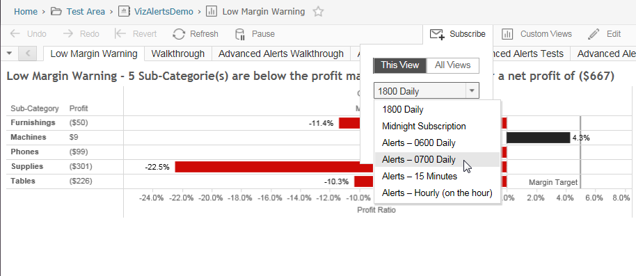

The *view*’s job is to define the criteria for triggering the alert and
the content displayed within it. The scheduled *subscription’s* job is
to define at what times and how frequently the view is checked to see if
an alert should be sent.

There are two modes of email automation supported by VizAlerts: **Simple
Alerts** and **Advanced Alerts**. Simple Alerts are basic email notifications
that will send an image of the viz, with the viz data attached as a CSV file.  Advanced Alerts allow for a huge range of customizations.

Simple Alerts 
=============

**NOTE: If you are using Tableau Server 10.1 or higher, “Simple Alerts”
have been integrated into the product itself in a feature called
Conditional Subscriptions. See** [**this
post**](https://community.tableau.com/docs/DOC-9666) **for a comparison
of both.**

True to its name, this is the simplest and easiest form of alerting. The trigger for whether an email is sent to the subscriber or not is simply **whether or not 
data is showing in the view** when the Schedule runs. If there is, an email is sent. Otherwise, it isn't. 

Anyone with “view” permissions to a View on Tableau Server can subscribe
to it on an Alert schedule, and it will be delivered to them if and only
if it is triggered. This means that I could send the URL to the view
above to all my co-workers and tell them that if they want to get alerts
sent to them at 6AM like I get, they only need subscribe to it on the
same schedule.

And here is what the Simple Alert they’d get looks like as an email:

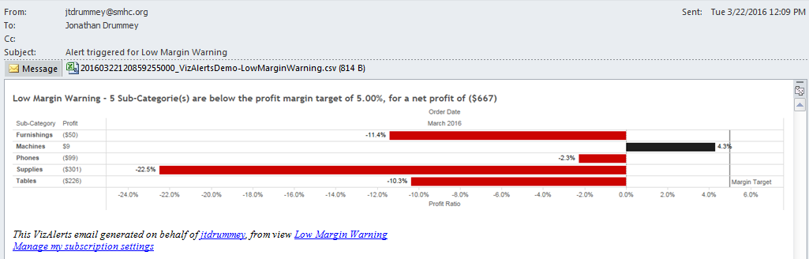

The PNG rendering of the View itself is embedded in the email, and the
data from the View is attached in CSV format. The image is linked back
to the View on Tableau Server, just as in a Subscription. The CSV is
simply there to provide additional information that might not be exposed
visually, and to provide a static historical record of what caused the
alert to be triggered (by the time you open your email and click the
link to investigate, the data behind the View may have changed).

**So wait**—what if someone picked a View that wasn’t designed to be an
Alert, and subscribed to it on a custom Alerts schedule? What would
happen?

The answer is: A Subscription, effectively. Except they’d also get the
CSV data attached to the email.

There are a few other important things to know about Simple Alerts:

-   VizAlerts will **impersonate** the Subscriber when it checks for viz
    data from the View they subscribed to. Therefore, any user filters
    set up that are based on who is viewing the viz will apply as if the
    Subscriber had pulled the view up manually in a browser. This
    provides an easy way for one person to author an Alert that will be
    triggered at different times depending on who subscribed to it, if
    so desired.

-   If a user creates a Customized View from your original Alert view,
    they can subscribe to it if they like, and VizAlerts will process it
    just like any other Alert. This provides additional flexibility if
    individuals want to tweak specific criteria to trigger their alerts.

All this Simple Alert stuff is well and good, but maybe “simple” isn’t a
word that describes you. Maybe you’re more the *power user* type. In
that case, please proceed to:

Advanced Alerts 
===============

Advanced Alerts are triggered differently than Simple Alerts are,
and they allow you extremely granular control over **what** you send to
**whom**.

What tells VizAlerts that a given alert is an Advanced Alert (and not a
Simple Alert) is the presence of an “Action Field”. These are fields named specific ways that you must add to your vizzes to tell VizAlerts what *kind* of action to take. The Action Fields tell
VizAlerts the details it needs to know in order to perform that
particular action. Because these “Action Fields” can be from raw data or
calculated fields that are dynamically generated from your data, the
possibilities as to what you can do are nearly limitless!

### Advanced Alert Fields 

#### Email Action Fields:

<table>
<tbody>
<tr>
<td width="149"><strong>Field Name</strong></td>
<td width="100"><strong>Required to send Email?</strong></td>
<td width="500"><strong>Structure and Description</strong></td>
</tr>
<tr>
<td width="149">Email Action *</td>
<td width="100">Yes</td>
<td width="500">Tells VizAlerts whether an email should be sent or not.  If value = 1: Send an email with information provided from the other Email action fields  If value = 0: Send no emails
</td>
</tr>
<tr>
<td width="149">Email To</td>
<td width="100">No</td>
<td width="500">Email address(es) to send the email to, separated by commas, semicolons, or spaces. If an email is to be sent, and this field is missing, it will default to the email address of whoever subscribed to the VizAlert.
</td>
</tr>
<tr>
<td width="149">Email From</td>
<td width="100">No</td>
<td width="500">Email address to use for the From address. If an email is to be sent, and this field is missing, the VizAlert will default to the <i>smtp.address.from</i> setting specified in config\vizalerts.yaml.
</td>
</tr>
<tr>
<td width="149">Email CC</td>
<td width="100">No</td>
<td width="500">Email address(es) to CC the email to, separated by commas, semicolons, or spaces. If an email is to be sent, and this field is missing, no addresses will be CC'd.
</td>
</tr>
<tr>
<td width="149">Email BCC</td>
<td width="100">No</td>
<td width="500">Email address(es) to BCC the email to, separated by commas, semicolons, or spaces. If an email is to be sent, and this field is missing, no addresses will be BCC'd.
</td>
</tr>
<tr>
<td width="149">Email Subject</td>
<td width="100">No</td>
<td width="500">The subject of the email. If an email is to be sent, and this field is missing, a generic subject will be automatically generated based on the view name.
</td>
</tr>
<tr>
<td width="149">Email Body</td>
<td width="100">No</td>
<td width="500">HTML text representing the body of the email. If an email is to be sent, and this field is missing, a linked image of the trigger viz will be embedded as the body. 
</td>
</tr>
<tr>
<td width="149">Email Header</td>
<td width="100">No</td>
<td width="500">HTML text that will be inserted before the Email Body text. This is useful when using the Consolidate Lines feature. If an email is to be sent, and this field is missing, no header is inserted.
</td>
</tr>
<tr>
<td width="149">Email Footer</td>
<td width="100">No</td>
<td width="500">HTML text that will be inserted after the Email Body text. This is useful when using the Consolidate Lines feature, and for overriding the default footer. If an email is to be sent, and this field is missing, a default VizAlerts footer will be used. To use no footer, add this field to the viz with an empty string, ''.
</td>
</tr>
<tr>
<td width="149">Email Attachment</td>
<td width="100">No</td>
<td width="500">Files to be attached to the email, specified as Content References. No specific delimiters are needed--any content references found that have a file output (e.g., VIZ_IMAGE(), VIZ_CSV(), VIZ_PDF() ) will be rendered to file, and the file will be attached. If an email is to be sent, and this field is missing, no attachments will be added.
</td>
</tr>
</tbody>
</table>

#### SMS Action Fields:

<table>
<tbody>
<tr>
<td width="149"><strong>Field Name</strong></td>
<td width="100"><strong>Required to send SMS?</strong></td>
<td width="500"><strong>Structure and Description</strong></td>
</tr>
<tr>
<td width="149">SMS Action *</td>
<td width="100">Yes</td>
<td width="500">Tells VizAlerts whether an SMS should be sent or not.  If value = 1: Send an SMS with information provided from the other SMS action fields  If value = 0: Send no SMS
</td>
</tr>
<tr>
<td width="149">SMS To *</td>
<td width="100">Yes</td>
<td width="500">Email address(es) to send the email to, separated by commas, semicolons, or spaces. If an email is to be sent, and this field is missing, it will default to the email address of whoever subscribed to the VizAlert.
</td>
</tr>
<tr>
<td width="149">SMS Message *</td>
<td width="100">Yes</td>
<td width="500">Message text for the SMS. Can be left blank/Null if desired.
</td>
</tr>
<tr>
<td width="149">SMS Header</td>
<td width="100">No</td>
<td width="500">Text that will be inserted one time at the beginning of the SMS message. This is useful when using the Consolidate Lines feature. If an SMS is to be sent, and this field is missing, no text will be inserted before the SMS Message *.
</td>
</tr>
<tr>
<td width="149">SMS Footer</td>
<td width="100">No</td>
<td width="500">Text that will be inserted one time at the end of the SMS message. This is useful when using the Consolidate Lines feature. If an SMS is to be sent, and this field is missing, no text will be inserted after the SMS Message *.
</td>
</tr>
</tbody>
</table>

#### General Fields:

<table>
<tbody>
<tr>
<td width="149"><strong>Field Name</strong></td>
<td width="500"><strong>Structure and Description</strong></td>
</tr>
<tr>
<td width="149">Consolidate Lines</td>
<td width="500">When this field is present in the viz data, multiple lines of Body / Message data will be consolidated into one single email / SMS. If "Header" and/or "Footer" fields are present, these will be added only one time to the start and end of the final Body, respectively.  
This can be useful if multiple pieces of information need to be added to the same or message, rather than being sent as separate emails. It can also be helpful for advanced formatting.  
To determine which lines belong to the same email, the recipients (To, From, CC, and BCC) and Subject are used (for SMS, just the To number). When those lines are the same for multiple rows, each subsequent Body is appended to the previous, and the email or SMS is sent.  
Note that the *value* for this field is completely disregarded; its mere presence causes the viz to be processed with consolidation turned on.                
</td>
</tr>
<tr>
<td width="149">Sort Order</td>
<td width="500">This can be used with the Consolidate Lines option to determine the ordering of which lines are processed first.  
If present, the Body rows *within* a given consolidated email are sorted alphabetically (ascending) by the value of the Sort Order field.   <strong>Note that numbers are treated as text, so "11" will come before "2". If using numbers, it's recommended to prepend 0 for the maximum number of digits you will have, e.g. "001, 002, ... 133, 134.<strong>
</td>
</tr>
</tbody>
</table>

### Field Names Are Customizable 

You do **not** need to match these fields exactly for VizAlerts to
recognize them. You can prepend and append whatever characters you like,
the key is the “Email To”, SMS Action”, etc. For example, names like
“Email To”, “ Email To”, “Jim’s Email To”, “Jacqui’s Email To”, 
“Email To Boris”, would all be recognized as the Email To field. Besides being 
easier to get the fieldnames right, this flexibility 
allows you create fields for different alerts that use the same data source.

### Important Info About Advanced Alerts 

While VizAlerts supports Unicode characters in general, it cannot at
this time send mail to email addresses containing them. If any are
detected, an error email will be sent instead.

Though an Advanced Alert email can contain views from entirely different
workbooks, all of those workbooks must reside in the same Tableau Site.
You can’t combine views from multiple Sites into the same email.

An Advanced Alert is executed via Subscription, just as a Simple Alert
is, but with a couple of key differences:

-   **Single Subscriber**: Only the **author** of the Advanced Alert can
    set up a Subscription to that Advanced Alert. Any other user’s
    subscription to it will be disregarded. To avoid confusion, it may
    be useful to limit View permissions on them, so other users cannot
    subscribe at all.

-   **Impersonation**: VizAlerts will use the **author’s** Tableau
    Server user to generate the content for the Advanced Alert. This
    means that the author is solely responsible for ensuring that any
    content being emailed out is appropriate to the intended audience.

Advanced Alerts Walkthrough \#1 – Send the Trigger Viz 
------------------------------------------------------

Okay, so let’s say we don’t want to have to tell people to subscribe to
the simple alert from the previous example. Instead, we want to just
deliver it to their inbox automatically at 7AM every day! Let’s build a
trigger view for an Advanced Alert to support that.

First, open the VizAlertsDemo workbook in Tableau Desktop to the
“Walkthrough \#1 – 1” worksheet:

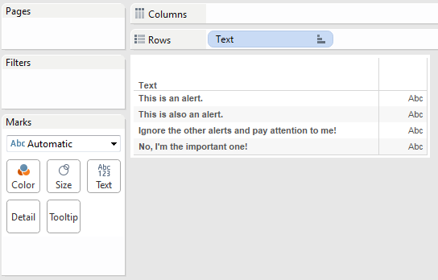

Okay. We have a field called “Text” in there. That’s not useful since it
doesn’t map to any email properties. We need the fields to have the
proper conventions in order to tell VizAlerts what to do. Thankfully, 
our data source already contains some pre-built fields named the right way 
that we can use in our viz.

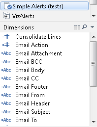

Nice! And each has a comment describing its own usage:

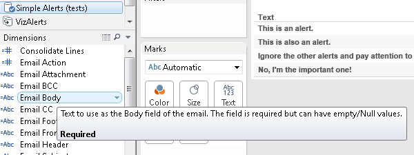

If you are starting your alert from scratch, you don't want 
to have to do all that typing and clicking, so for a shortcut next time,
 just copy the fields from the VizAlerts data source in this workbook, and paste them directly into your data source. It will save you a bunch of time.

We now need to edit the Action Fields to tell VizAlerts how to build the email. The first thing we need is the Email Action field. Using that field 
is a prerequisite for using any of the other Email fields. Remember that 
when the value is "1", an email will be sent. If it's "0", none will be sent. 
We'll leave ours at "1" for this walk through, so emails will always be sent whenever this alert runs.
Go ahead and drag it to the Rows shelf.

For the Email Subject field, let’s create a calculation and put the
date into it:  

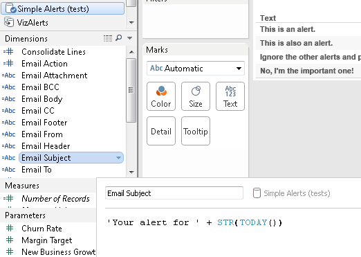

And for the Email To field, let’s make it a parameter so we can
change it:  

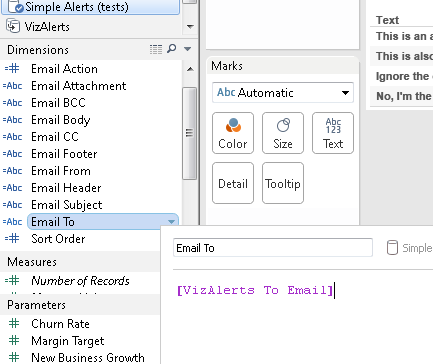

Set the value of the "VizAlerts To Email" parameter to your own email address,
 then drag the Email To field to the Rows shelf, along with Email Subject. 
Okay, so after all that work, here’s what we have so far:  

If we did nothing more than test the alert in its present state, we'd get a single email sent to the Email To address, with the custom subject, and an 
image of the viz you see right now embedded in the body.

Why just one email? There are four rows in the viz, so shouldn't there be 
four emails? Nope, and the reason why is one of the key things to understand about how VizAlerts works.

First, when VizAlerts runs, it grabs *only the Action Fields* in your viz 
to determine what to do. Any other field is completely ignored.

Secondly, once it has determined what the fields are, it removes all duplicate 
data. Because there are only one combination of values for the data in our Action fields right now, only one email will be generated.  

Unfortunately, the single email we'll generate isn't very interesting. So let's 
build a custom body for our email. We'll use the Email Body field, and just 
substitute in the Text field:
  

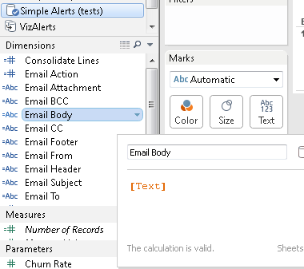

Remove the Text field from the viz, and we now have:  

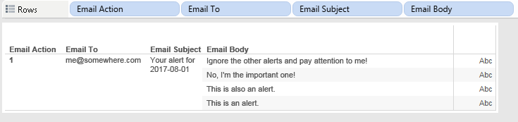

How many emails are sent now? Four. Because our Email Body action field contains 
four separate values, four unique emails will be sent. 

(The finished alert worksheet can be seen at VizAlertsDemo\\Walkthrough \#1 –
2).

Now that we’re ready to have this alert run, we need to publish it to
Tableau Server and subscribe to it on one of the Alerts schedules, just
as we did for the Simple Alert. We don't have to wait for the schedule to run to 
test it, though. Just enter a comment on the viz with the text "test_alert", 
and VizAlerts will run it one time:

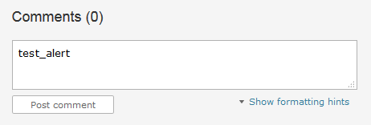

The results of the alert we set up should hit your inbox like so (except to your own 
address, not Jonathan's ;) ):

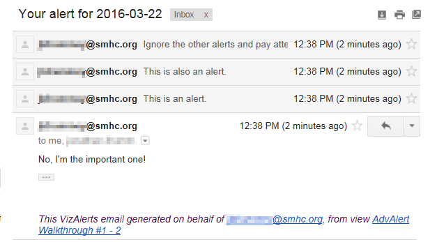

And the same set of emails went to the Gmail address at the same time.

As we’ve seen, the email properties are fields in Tableau. Since we made
these calculated fields, they could just as easily be set up in the data
source. You can control for each row who gets what email. This allows
you to use your data to drive the logic behind who is sent an email and
what it contains, and more!

Advanced Alerts Walkthrough \#2 – Send a Custom Viz 
---------------------------------------------------

For this example we’re going to set up an Advanced Alert that sends the
initial Low Margin Warning viz to the manager of each product category
whenever any sub-categories in their product category meet the target.
There are a few steps to setting up this kind of Advanced Alert:

1.  Set up the view(s) that you want to send.

2.  Set up the trigger view:

    1.  Identify how many emails you’ll be sending – in other words,
        what defines the trigger viz Level of Detail (vizLOD)?

    2.  Apply the necessary filters and / or calculations that will be used as the trigger for
        sending the alert.

    3.  Identify the recipients and boilerplate content for each email.

    4.  Create the necessary custom content references that will pull
        the views from \#1.

    5.  Validate that everything looks right.

3.  Publish your trigger view and any necessary content views.

4.  Subscribe the trigger view to the VizAlerts schedule.

5.  Sit back and enjoy!

This next part goes through these steps to set up the alert:

1.  The original Low Margin Warning view doesn’t need any changes, we’ll
    ultimately filter that view using a URL parameter.

2.  For the trigger view we’re going to use a data blend. The primary
    source will be the same Superstore sales source used to generate the
    Low Margin warning, the secondary source gets us the email
    addresses, email body, and content references. This is an example of
    a situation where we want to trigger the alerts based on an
    operational source that is at one level of detail (individual
    order items) while the alerts are being set up and controlled via a
    separate source at a coarser level of detail (the product category)
    that might have a completely different owner and maintainer.  
      
    The secondary source is an Excel spreadsheet that is mostly set up
    with formulas, we’ll describe what’s happening in the Email Body
    further down.  
    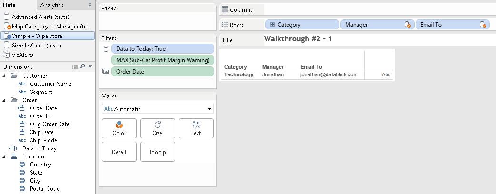  
      
    You can see this spreadsheet in the \[VizAlerts install
    folder\]\\demo\\test.xlsx file.

    1.  We know that we want just one email per category. In Tableau,
        the VizAlertsDemo\\Walkthrough \#2 – 1 viz shows the Category
        dimension from the Superstore primary and then the Manager and
        Email To from the secondary, blending on Category:  
          
        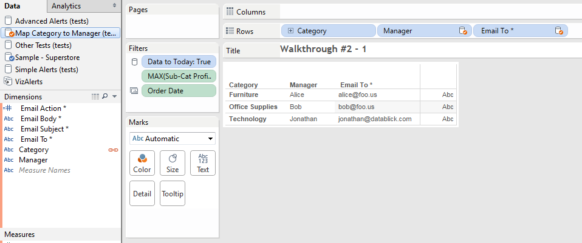

    2.  Now we need to set up our alert criteria. We can specify our criteria
		either by filtering all data out that we don't want to use to trigger 
		the alert, *or* we can define it in the Email Action calc. We don't really 
		need the additional context of other data in this case, so we'll keep it 
		simple and stick with just using filters for this example. 

		In this case we only want to return
        Categories that have one or more Sub Category’s profit margin
        below the margin target. We can do that in Tableau using a
        variety of means, but in this case we will use a Level of
        Detail (LOD) expression:

        1.  Sub-Category Profit Ratio uses {INCLUDE \[Sub-Category\] :
            \[Profit Ratio\]} to return the Profit Ratio for each
            Sub-Category as a record-level value. (For the purposes of
            this demo we’re skipping some validation steps on this
            LOD expression).

        2.  Sub-Category Profit Margin Warning uses IF \[Sub-Category
            Profit Ratio\] &lt; \[Margin Target\] THEN 1 ELSE 0
            END.\*\*\* When MAX() is wrapped as an aggregation to the
            vizLOD of Category we end up identifying whether any
            sub-categories have met the criteria – in this case, all the
            Categories have at least one sub-category:  
              
            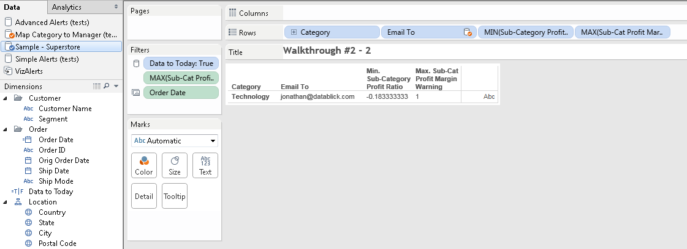  
              
            Then we can put that field on the Filters Shelf, filtering
            for 1 in this case.  
              
            \*\*\* If you are using Tableau v9.2 or higher then you
            don’t need the IF statement anymore and can use just use the
            condition that returns a Boolean. See
            <http://drawingwithnumbers.artisart.org/feature-geek-how-to-have-sets-with-your-secondary-9-2-style-via-aggregated-booleans/>
            for more details.

    3.  Now to get the recipients and boilerplate of each email. In this
        case the Excel file has been set up with all of those details,
        the Email Body is HTML formatted for a more desirable look.

    4.  Finally we need to set up the custom content references, this
        was also done in the Excel source. In these emails
        the VIZ\_IMAGE() custom content reference is used to insert a
        PNG image inline in the body text. Here’s breaking down the
        parts of that VIZ\_IMAGE reference.

        1.  **VIZ\_IMAGE()** – tells VizAlerts to download a PNG image,
            we could get a CSV or PDF if we wanted.

        2.  **VizAlertsDemo/LowMarginWarning** is a custom view
            reference to the workbook and view name, this is what we see
            in our browser bar after http://\[myservername\]/\#/views:  
            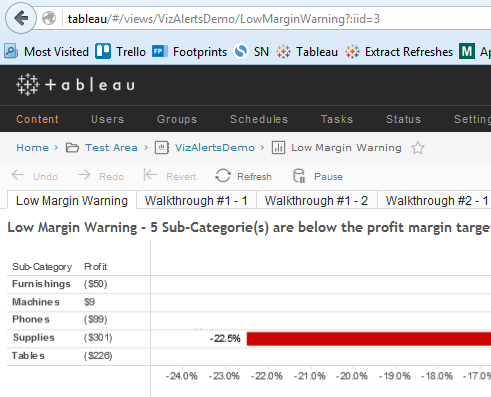  
            Note that in this case the trigger view and the custom view
            reference are both in the same workbook, they don’t have to
            be!

        3.  **?Category=" & A2** uses an Excel formula that fills in the
            actual text for Category and generates the following output
            in Tableau:  
            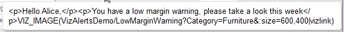  
              
            This is a URL parameter that will be used to filter the
            LowMarginWarning viz when the trigger view is processed, see
            [How View URLs Are Structured](https://onlinehelp.tableau.com/current/pro/desktop/en-us/help.html#embed_structure.html)
            for more details.

        4.  **"&:size=600,400** uses another Tableau URL parameter to
            set a custom size of the output PNG.

        5.  **|vizlink** is a VizAlerts option that tells VizAlerts to
            make the inline PNG also have a hyperlink back to the viz so
            the email image is clickable (or tap-able).  
              
            For more details on these options (and more!) read the
            **Additional Advanced Alert Features** section below.

    5.  Now to validate. Here’s the Walkthrough \#2 – 3 view that has
        the additional fields added for the Subject and Body:  
        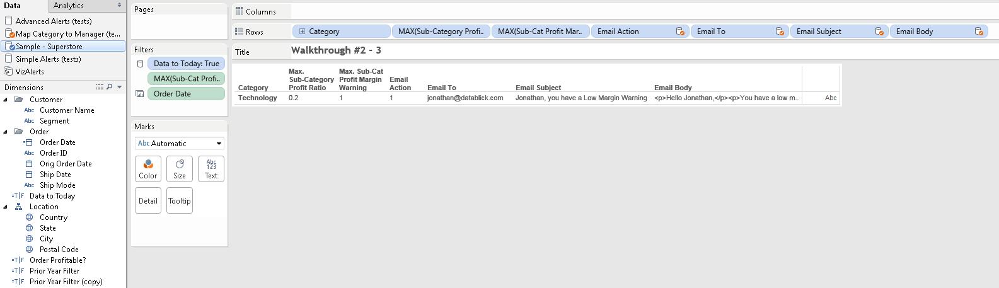  
          
        Now this trigger viz could work just fine as the trigger view
        for an Advanced Alert since VizAlerts will ignore the fields
        that don’t start with “Email”. However we can clean up the view
        even more and get rid of those other fields, this is the
        Walkthrough \#2 – 4 worksheet:  
        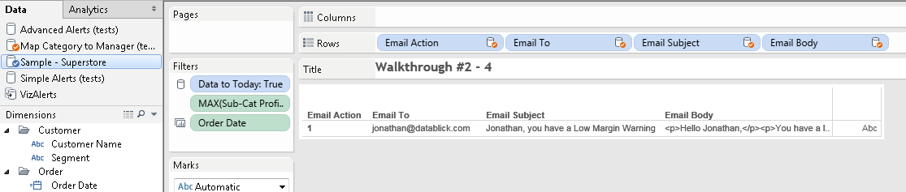

3.  Now we’re ready to publish the views to Tableau Server.

4.  Use the test_comment feature to test it out again.
      
    

When the alert is sent here’s an example email:

So that’s an example of how you can customize an Advanced Alert that
hopefully gives you some thoughts about what you can do!

Additional Advanced Alert Features 
==================================

With Advanced Alerts come several options to allow even more
customization in the content sent by the alert. These include:

-   Custom Body, Header, and Footer.

-   Content References

-   Appended (non-inline attachments)

-   Consolidated Alerts

-   Merged PDFs

Custom Body, Header, and Footer 
-------------------------------

The **Email Body** field is a required field, though there are no
required values for the field. i.e. you can leave it Null while using of
other Advanced Alerts features, for example you might want to send an
email that just has an attachment. The Email Body field passes any
HTML formatting you include in it into the body of the email you
compose, which allows you to customize the look of the content in your
email. There are two other fields that you can customize with HTML
formatting:

-   **Email Header**

-   **Email Footer**

The custom header and footer only really make sense to use when you are
also using the consolidated emails functionality since otherwise you
could just add the additional info to the **Email Body** field
directly, see [Consolidated Alerts](#consolidated_alerts) for more details.

Please note that using the **Email Footer** field in your viz will
*replace* the standard VizAlerts footer that’s automatically appended to
alert emails. If you wish to add your own footer, but don’t want to get
rid of the standard footer at the bottom, put the content reference
“**VIZALERTS\_FOOTER()**” anywhere in your footer data will cause it to
be added at that location. See the VizAlerts.tdsx helper datasource for
an example.

Content References 
------------------

Advanced Alerts supports inserting some pre-defined objects in a single
alert using placeholder text, including support for views that aren’t
the Advanced Alerts trigger view.

-   **VIZALERTS\_FOOTER()**  
    When placed in the Email Footer this adds the default VizAlerts
    footer to the email in addition to any other text in the Email
    Footer field.

-   **VIZ\_LINK()**
    This can be used in the Email Body, Email Header, Email
    Footer, or SMS Message fields, and will include an hyperlink to
    the referenced viz as an alternative to having to create http: links
    yourself, see below for more details.

-   **VIZ\_IMAGE()**  
    This placeholder can be used in the Email Body, Email Header,
    Email Footer, or Email Attachment fields and will include a PNG
    image of the referenced viz. When in the body, header, or footer the
    PNG will be included as an inline image placed within the text of
    the email. The optional **|vizlink** argument makes the inline image
    a hyperlink back to the Tableau view. When in the Email Attachment 
    field the PNG will be included as an appended (non-inline)
    attachment. Custom filenames are supported for appended attachments.

-   **VIZ\_CSV()**  
    This placeholder can be used in only in the Email Attachment field
    and will cause the CSV of the referenced viz to be included as an
    appended (non-inline) attachment. Custom filenames are supported for
    appended attachments.

-   **VIZ\_PDF()**  
    This placeholder can be used in only in the Email Attachment field
    and will cause a PDF of the referenced viz to be included as an
    appended (non-inline) attachment. Custom filenames are supported for
    appended attachments.

There are a number of ways we can customize the various content
references. The rest of this section has more details on customizing
views, using URL parameters, custom filenames, and more!

### Custom View References: Getting Almost Any View from Tableau Server 

When called with no arguments, the VIZ\_LINK(), VIZ\_IMAGE(),
VIZ\_CSV(), and VIZ\_PDF() content references will use the Advanced
Alerts trigger view for the link, image, or data. We can go beyond that,
though, by referencing most any viz we want to! For example,
**VIZ\_IMAGE(\[workbookname/viewname\])** will render the given
**\[workbookname/viewname\]** as a PNG.

In general the easiest way to construct these references is to go to
Tableau Server in your web browser, find the view that you want, and
copy the appropriate portion of the URL. For example if the URL is
<http://myServer/views/SalesData/SalesDashboard>, then the argument for
VIZ\_IMAGE() would be VIZ\_IMAGE(SalesData/SalesDashboard), i.e.
everything after the …/views/.

#### Limitations on Content References

-   All referenced views must be within the same Site as the
    trigger view.

-   Each content reference is subject to the same timeout limit that the
    alert itself has. Referencing a set of view that take ten minutes to
    load is generally a bad idea, so keep ‘em snappy.

-   The author of an Advanced Alert must have permissions to access all
    of the content they reference in their alert.

-   It’s *absolutely* a best practice that the author should generally
    only **be referencing views that they themselves own**, or are owned
    by individuals who **work with the author closely**. It’s possible
    to reference any view that you have the appropriate permissions for,
    but without close coordination, it’s likely that they will change
    over time and cause unexpected problems with your alert.

### URL Parameters 

Content References also support URL Parameters as described in [Filter
Views Using URL
Parameters](http://kb.tableau.com/articles/knowledgebase/view-filters-url).
For example, you could use VIZ\_IMAGE(VizAlertsDemo/Product?Region=East)
to send only the East data in an email. Keep in mind that you do need to
URL encode any values passed into the URL parameters. For example:

VIZ\_PDF(VizAlertsDemo/Product?Customer%20Segment=Corporate)

If you want to filter the trigger view itself, without explicitly
referencing it, you can do that by adding just the URL parameter, for
example:

VIZ\_CSV(?Customer%20Segment=Corporate)

Note that VizAlerts uses the “|” (pipe) character as a delimiter for
additional arguments after the URL parameter for filenames, etc. so if
your custom views are requiring URL parameters using “|” then you will
need to URL encode those “|” characters.

Also, VizAlerts automatically adds the **:refresh=y** URL parameter to
make sure that your outgoing emails contain the latest data.

#### Controlling PNG Size

A given VIZ\_IMAGE() content reference will be rendered as one of two
sizes:

1.  If the view is a dashboard with a fixed size or minimum size that is
    larger than the VizAlerts default, that size will be used.

2.  The VizAlerts default size that was configured by your administrator
    when VizAlerts was installed.

Thankfully there’s a 3rd option: Tableau Server has an undocumented URL
parameter for controlling the size of PNG images. You can add
**:size=\[width\],\[height\]** as an additional URL parameter to you viz
reference. For example:

VIZ\_IMAGE(mySalesData/mySalesDashboard?Region=East&:size=400,600)

There are a couple of limitations on controlling the PNG size when the
referenced viz is a dashboard (based on Tableau’s default behavior):

-   If a dashboard has a range of sizes then you can't set the image
    size smaller than the minimum range or bigger than the
    maximum range.

-   If a dashboard has a fixed size you can’t change it.

### Custom Filenames for Appended Attachments: |filename 

For appended attachments the default filename is
YYYYMMDDHHMMSSUUUUU\_\[workbookname\]-\[viewname\].\[filetype\] where:

-   YYYYMMDDHHMMSSUUUUU is the Year, Month, Day, Hour, Minute, Second,
    Microsecond

-   \[workbookname\] \[viewname\] are the referenced viz

-   \[filetype\] is png, csv, or pdf.

We can override the default filename by adding
**|filename=\[filename\]** after the custom view and URL parameters
where the leading character is “|” (pipe delimiter) and \[filename\] is
the desired filename (including any spaces). VizAlerts will
automatically append the filetype based on the content reference. For
example VIZ\_CSV(AnnualReport/Overview|filename=Annual Report) would
append a file named “Annual Report.csv”. See the sections on appended
attachments and merged PDFs for more details.

#### Timestamps and Other Dynamic Elements for Custom Filenames

If you want a timestamp or some other per-view element like a unique ID
on a custom filename then you can build your own using calculated fields
in Tableau as you build the trigger view or using functions in your data
source. For example if I’ve got a data source with Alice, Bob, and
Carlos as records and I want the monthly productivity dashboard PDF to
have a name like “Alice Productivity Feb 2016.pdf” then I could build
the content reference to be:

> "VIZ\_PDF(Productivity/Dashboard?Employee=" + \[Employee\] + "|filename=" + 
> \[Employee\] + " Productivity " + LEFT(DATENAME('month',TODAY()),3) + 
> " " + DATENAME('year',TODAY()) + ")"

### Hyperlink Text References: VIZ\_LINK()

When using the VIZ\_LINK() content reference, the default text of the
link will be the reference to the trigger view (if just VIZ\_LINK() is
used) or the view referenced within the parentheses, including any URL
parameters. For example, if the reference is:

VIZ\_LINK(VizAlertsDemo/Shipping?Region=East)

…then the generated HTML would be something like:

“&lt;a
href=http://myTableauServer/views/VizAlertsDemo/Shipping?Region=East&gt;VizAlertsDemo/Shipping?Region=East&lt;/a&gt;”

By using the **|filename** option we can use our own text, for example:

VIZ\_LINK(VizAlertsDemo/Shipping?Region=East|filename=Shipping
Dashboard)

…would generate HTML like:

“&lt;a href=”http://myTableauServer/views/
VizAlertsDemo/Shipping?Region=East”&gt;Shipping Dashboard&lt;/a&gt;”

If you leave the |filename option blank, then VizAlerts will use the
default view reference. If you want the generated to be just the http:
hyperlink then use the **|rawlink** option, for example:

VIZ\_LINK(VizAlertsDemo/Shipping?Region=East|rawlink)

…would generate just:

“http://myTableauServer/views/ VizAlertsDemo/Shipping?Region=East”

For SMS Messages, the “raw” version of the link is always used.

### Hyperlinked Inline Images: |vizlink

When VIZ\_IMAGE() is used to embed images inline we might want to make
the image clickable so that users will automatically go to the Tableau
Server view. Adding **|vizlink** after the custom view tells VizAlerts
to add a hyperlink to the image. For example
VIZ\_IMAGE(VizAlertsDemo/Product?Region=East|vizlink) would make the
inline image also a hyperlink back to the image on Tableau Server.

### Merge Multiple PDFs : |mergepdf

If there are multiple PDFs in a single VizAlerts email it’s possible to
merge sets of them together into one or more PDFs. This option requires
that a custom **|filename** be used for each output PDF that you want.
The option is configured by adding **|mergepdf** to the content
reference argument. For example, an email might have two content
references:

VIZ\_PDF(VizAlertsDemo/Overview?Region=East|filename=EastSales|mergepdf)

and

VIZ\_PDF(VizAlertsDemo/Product?Region=East|filename=EastSales|mergepdf)

Those would be merged into a single EastSales.pdf attachment. See below
for more details on merging PDFs.

Appended (non-inline) Attachments 
---------------------------------

We can add one or more content references to the **Email Attachment**
field to append non-inline file attachments of downloaded views. For
example, the VizAlertsDemo\\AdvancedAlertsDemo worksheet has a set of
content references that include two merged PDFs and a CSV:

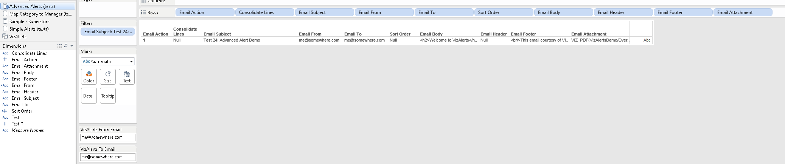

These show up in our email application as file attachments to the
message:

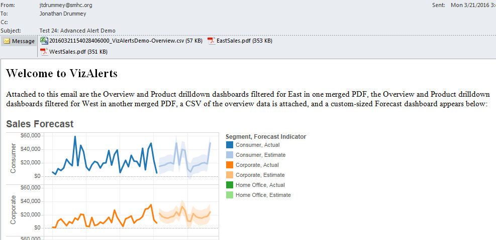

CSVs and PDFs can only be included in VizAlerts emails as appended
attachments, PNG attachments can be included inline in the body, footer,
and/or header, or be appended.

If we want to append multiple attachments to a given email there are two
ways this can be configured:

-   Put multiple content references into a single Email Attachment
    field as in the above example.

-   Use consolidated emails. All appended attachments in all rows for a
    given consolidated email will be attached. See the Consolidated
    Emails section below for more info.

Note that VizAlerts will prevent collisions in filenames, if you try to
make totally different attachments in the same email have the have the
same filename then VizAlerts will revert to the default filenames for
the 2nd and successive attachments. If you want to merge
multiple PDFs into the same filename then you can use the **|mergepdf**
option.

Consolidated Alerts 
-----------------------------------------------------------------------------------------------------------------

There are several use cases for consolidated multiple alerts into a single
email or SMS:

-   VizAlerts is so awesome that your users sign up for a ton of alerts!
    But then they get bombarded with emails. By consolidating emails,
    their inbox won’t be quite so full.

-   There’s a manager who wants to get individualized dashboards for
    each of her direct reports, but doesn’t want an email for each
    person--just one email with all of the reports.

-   You want to generate an image or PDF for each region, product
    category, customer segment, etc. but can’t get the Pages Shelf to do
    what you want. VizAlerts can come to your rescue!

-   There is a process that generates multiple warning messages and you
    want them all in the same alert.

-   You hit a character limit in a single Tableau field and want to 
    expand the space you have by consolidating fields together! 

Consolidated alerts are turned on by having **Consolidate Lines** in
the trigger view. When this field is present in the trigger view, rather
than sending **one email or SMS per row** of data, VizAlerts will
consolidate the Body field and appended attachments across
**multiple rows**, as long as the Subject (only for emails) and **all**
recipient fields (To, From, CC, BCC) are the same. So in this view below
the three rows for Test 25: Consolidate emails w/no extras will be
consolidated into one email:

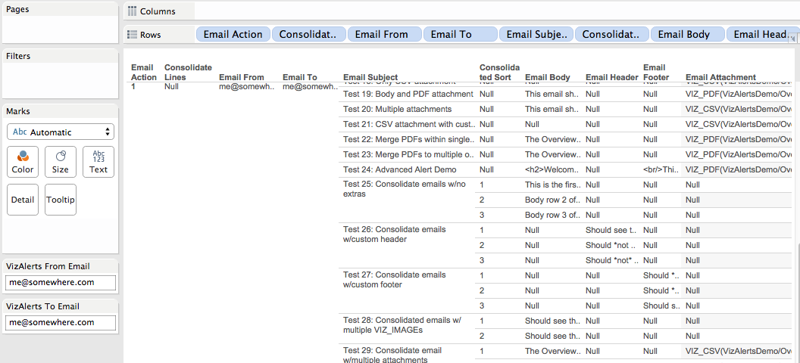

Here’s the email:

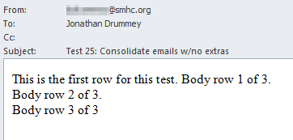

Note that email consolidation works at the trigger view level, and not
at the individual row level—you cannot consolidate some rows in your
trigger view, but not others (unless you've set the Action field to 0 so 
that VizAlerts ignores them entirely). If Consolidate Lines is present as a field 
in the viz, then VizAlerts will always attempt to consolidate emails across the Subject, To, From,
CC, and BCC fields, and SMS across the SMS To field.

### Newlines and Line Breaks 

Note that VizAlerts does not insert line breaks into headers, footers,
or the body of consolidated alerts. If you want line breaks then you can
use &lt;p&gt;&lt;/p&gt; tags or &lt;br&gt; tags in emails, or for SMS
messages either CHAR(10) or the following quote-newline-quote
construction:

“  
“

### Sorting Consolidated Alerts

When we’re using consolidated alerts, we often want the content to be
generated in a specific order within each email. The **Sort Order** field 
lets us do that. When it is present, the values in the field
are used to alphanumerically sort each row in the trigger view for each
email or SMS. Here’s an example setup from the
VizAlertsDemo\\AdvancedAlertsTests worksheet:

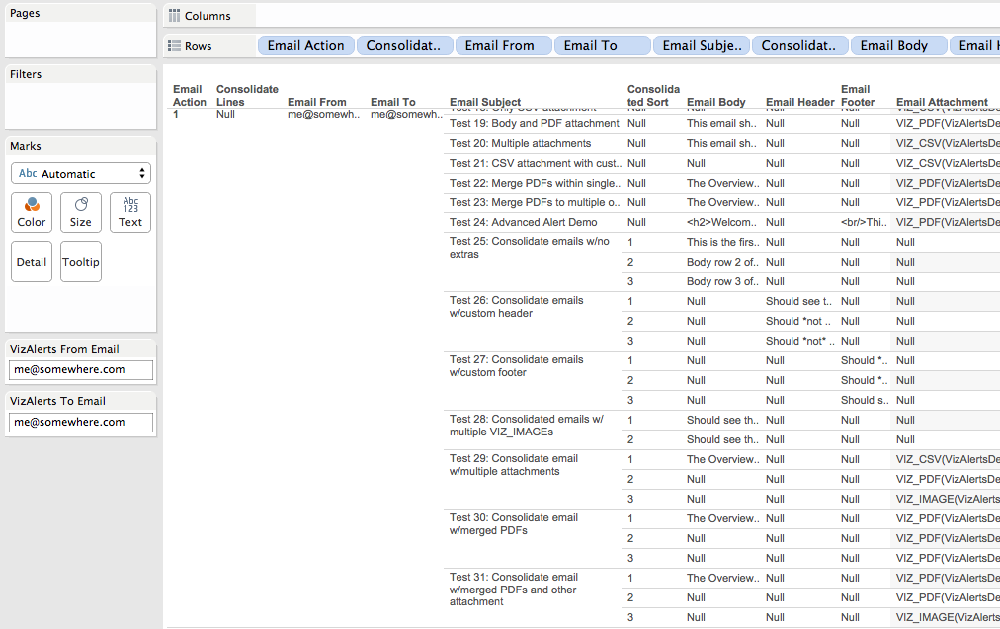  
  
In the above example, the numbering restarts for each consolidated email,
however it doesn’t have to. There are a number of ways you could get the
sort order without too much effort. Here are a couple of additional
examples:

-   If you were trying to generate an alphabetical list of product names
    then you could use the \[Product Name\] field values in the
    Sort Order field.

-   The INDEX() or RANK() functions in Tableau could generate a number
    that you could use.

### Headers and Footers in Consolidated Alerts

The optional **Email Header** and **Email Footer** fields find their
use in consolidated emails. The contents of the Email Header field in
the **first** row from the trigger view for a given consolidated email
are pre-pended to the body of the email, while the contents of the Email
Footer field from the **last** row for that consolidated are appended
to the body of the email.

For example you might use the Email Header for some intro text and an
image of an overview dashboard, and then the Footer would contain a link
to the dashboard, and all the other rows of the consolidated email would
have body text, or maybe no body text and just attachment content
references.

Also note the comments above regarding newlines and line breaks.

Merged PDFs 
-----------

From time immemorial (ok, sometime in the 21st century)
Tableau users have wanted to be able to do something close to
traditional batch reporting where a whole bunch of reports are merged
together into a single PDF suitable for the CxO to read on her next
cross-country plane flight. VizAlerts delivers!

The configuration of merged PDFs is described above in Merge Multiple
PDFs – you simply add the **|filename=\[filename\]** and **|mergepdf**
arguments to the **VIZ\_PDF()** content reference. Then when the email
is generated VizAlerts will scan through all the VIZ\_PDF() content
references (whether they come from multiple content references in a
given row or from multiple rows in a consolidated email, or both) for
the ones with the same fieldname and merge them together in order. If
you have multiple filenames with the |mergepdf option you’ll get
multiple merged PDFs.

Here’s an example where three dashboards are merged into a single PDF
using a consolidated email using test 30 from the
VizAlertsDemo\\AdvancedAlertsTests worksheet:

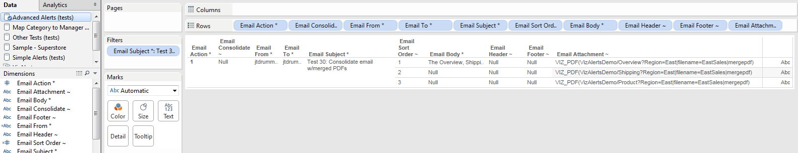

The email:

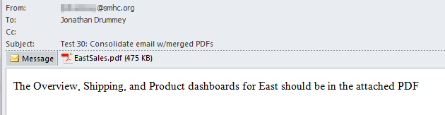

One nice feature here is that VizAlerts respects the Landscape/Portrait
orientation of each referenced view in the merged PDF, here are
screenshots of the first two pages of the above example:

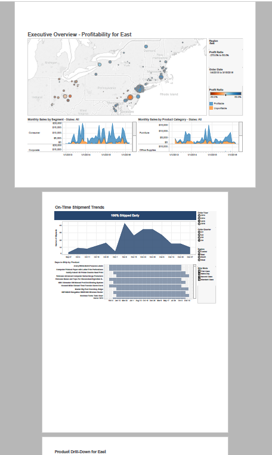

SMS Text Message Alerts 
====================================================================================================================================================================

SMS Alerts are a variation on Advanced Alerts that are SMS text messages
delivered to mobile devices. There are two ways to deliver text message
alerts from VizAlerts:

-   **Use an email-to-text gateway**  
    If your cellphone provider has a free email-to-text gateway, then
    you can use the given email address for the mobile phone as the
    Email To address for an email advanced alert, for example for
    AT&T in the USA the address is <xxxxxxxxx@txt.att.net> where
    xxxxxxxxx is the area code and full phone number of the
    mobile phone. As a bonus some cellular providers will even
    automatically convert emails with inline images for you into
    MMS messages.

-   **Use the built-in Twilio integration**  
    You can configure VizAlerts to send it’s messages through an SMS
    gateway provider, by configuring an Advanced Alert using
    SMS Actions. These messages are SMS only, inline images are
    not supported.

At this time the only supported SMS gateway is with
[Twilio](https://www.twilio.com/). To use the Twilio integration your
Tableau Server admin will need to have set up the VizAlerts
configuration file with the necessary information. See the VizAlerts
Install Guide for details.

The rest of this section is about configuring and using SMS Alerts with
the gateway since configuring Email Advanced Alerts is covered above.

SMS Alert Configuration
--------------------------------------------------------------------------------------------------------------------------------------------------------------------

SMS Alerts are set up in the exact same way as Email Alerts. You can
even make a trigger view that has rows for both Email Alerts and SMS
Alerts. Here’s a screenshot of the SMS test view located at \[VizAlerts
install folder\]\\demo\\VizAlertsTests.twb that has a couple of outgoing
emails along with various SMS alerts:

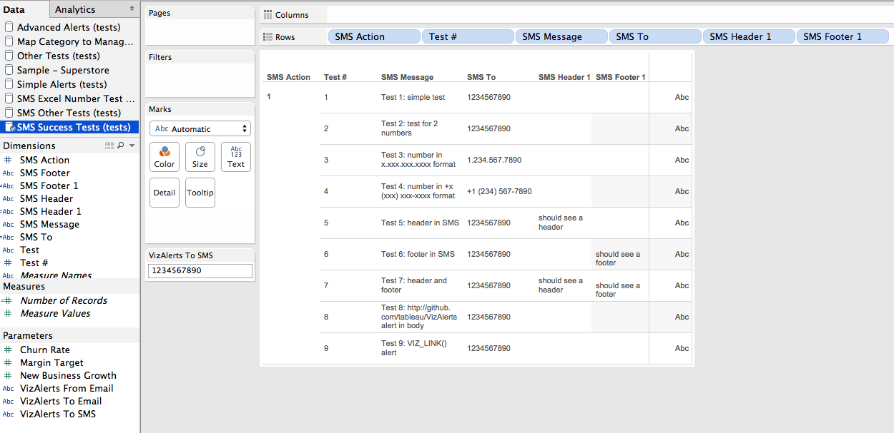

The trigger view for SMS Alerts uses the field names described at the
beginning of the Advanced Alerts section.

Supported Mobile Number Formats 
----------------------------------------------------------------------------------------------------------------------------------------------------------------------------

The ideal number format is E.164, that is +\[country code\]\[area code
(if applicable)\]\[dialing code\]. However, for convenience, the mobile
numbers you can use in the SMS To field can be in most any format.
The key elements are:

-   Country code

-   Area code (if applicable)

-   Dialing code

The valid characters in mobile numbers are the ten digits 0-9, hyphen -,
space , period ., and parentheses (), and plus sign +. For example the
following number formats are supported:

-   12071234567

-   +12071234567

-   +1-207-123-4567

-   +1 (207) 123-4567

-   1.207.123.4567

If you put multiple phone numbers in a single SMS To field they can
be separated by commas (,) or semicolons (;) such as 12071234567,
12069876543.

Important Info about SMS Advanced Alerts 
-------------------------------------------------------------------------------------------------------------------------------------------------------------------------------------

There are a number of complexities to configuring SMS Advanced Alerts:

-   SMS messages that are over 160 characters will be sent as multiple
    SMS messages to some phones whose carriers don’t support longer
    formats, so rates could be higher.

-   HTML will not render as HTML in a text message, so you’ll need to
    leave that out of the structure (especially to save space). However
    http:// and emailto:// links are generally hyperlinked
    on smartphones.

-   For Excel and text sources using the default connector Tableau will
    render 10 digit mobile numbers in scientific notation, so
    12071234567 becomes "1.207e10".
      
    The workaround is to force the number to be text. In Excel you can
    do this by prepending ‘ (single quote) to a number field, see how
    the formula bar is different from the display in this screenshot:  
      
    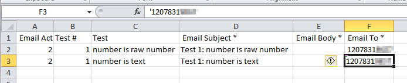  
      
    Another workaround is to add the + sign to the country code to cast
    the field as a string, alternatively in Tableau you can cast the
    number as a string using the STR() function.

-   SMS Providers will only deliver one text message per second. Message
    Services can be used in Twilio to increase the rate and volume at
    which messages are sent.

Content References for SMS Advanced Alerts 
---------------------------------------------------------------------------------------------------------------------------------------------------------------------------------------

The supported custom content references for SMS Advanced Alerts are:

-   **VIZALERTS\_FOOTER()**
    A more SMS-friendly footer is used, so it differs slightly from
    those used in Email Actions

-   **VIZ\_LINK()**  
    This content reference behaves slightly differently than
    Email Actions. No matter the options, only the URL (whether a custom
    one or to the trigger view) is sent in the SMS Alert. So
    the VIZ\_LINK() content reference in an SMS Advanced Alert always
    acts as if the **|rawlink** option is set. This is done because HTML
    doesn’t render in SMS messages and to save space in the messages.

Advanced Alert Use Cases 
========================

### Tableau Server Monitoring 

Here’s a link to a thread of a number of ways to use VizAlerts for
monitoring Tableau Server:
<https://community.tableau.com/s/question/0D54T00000C5Mm1SAF/alerts-youve-created-alerts-that-you-want>

### 

### Extract Failure to Refresh Notifications 

There are multiple ways to set up automated notifications for failure to
refresh extracts (the above link has one), here’s another:
<https://community.tableau.com/s/question/0D54T00000C5N8qSAF/example-email-users-whose-extracts-fail-to-refresh>

### Bulk Mailing

Using an Advanced Alert with custom URL parameters it is possible to
have very fine-grained controls for sending bulk emails from Tableau
Server of any view(s) you want. For example a user with the correct
permissions could set up a view that had a list of email addresses and
body that included custom URL parameters, for example to email out a
daily dashboard filtered for certain data:

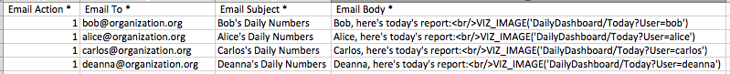

Since the data source could be generated with some simple formulas in
Excel, Tableau, or the data source, this offers a lot of flexibility for
configuring delivery.

### Consolidated Emails

As noted above there’s a “Consolidate Lines” option for Advanced
Alerts that will consolidate across the rows in the triggering viz. For
example this data would send out one email to Arundhati and
automatically include all the images of her direct reports:

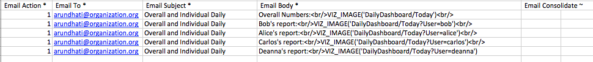

You can also embed multiple VIZ\_IMAGE() calls in the header, footer,
and/or body. So the same email could be generated using a single
(larger) email body:

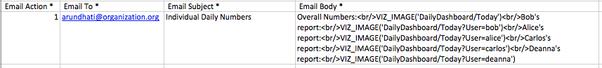

### Dashboard with Hidden Embedded Alert

This is an alternative method to setting up Advanced Alerts for a
Tableau dashboard that doesn’t require using custom VIZ\_IMAGE()
references. There are two important things to know when you set up a
Dashboard with a Hidden Embedded Alert:

1.  Only one View within the Dashboard can be used to trigger the Alert

2.  The triggering View is the one whose name comes first in
    alphabetical order

Given that, the way to ensure you get what you need out of the Dashboard
w/Hidden Embedded Alert is to **embed a specific View that serves as the
trigger** for the alert, and name it “-(Dashboard Name) Trigger”, e.g.
“-Sales Quota Dashboard Trigger”. The hyphen should ensure it comes
first and is therefore used as the trigger.

However, what if you don’t actually want to *display* the trigger view?
For Advanced Alerts in particular, you often don’t. To make it
invisible, use the Format menu to change text colors to the background
of the dashboard and remove borders:

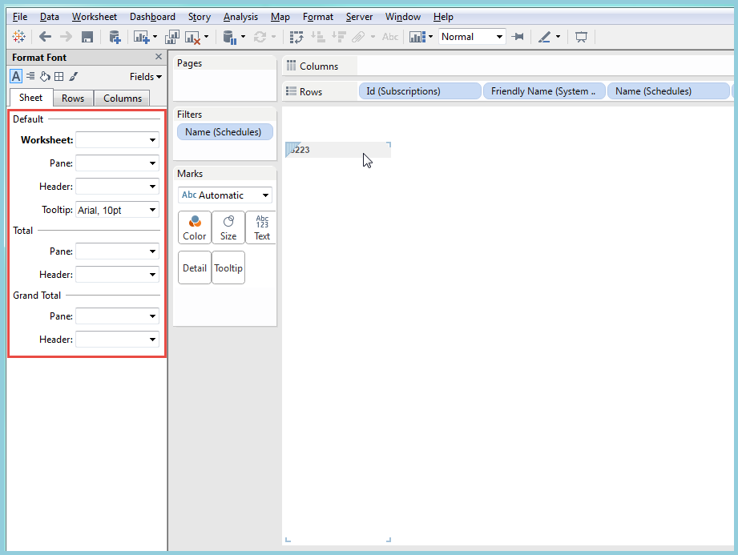

Then, place it in your Dashboard as a “floating” view, and drag the
container around it into as small a rectangle as possible. Place it
somewhere unobtrusive:

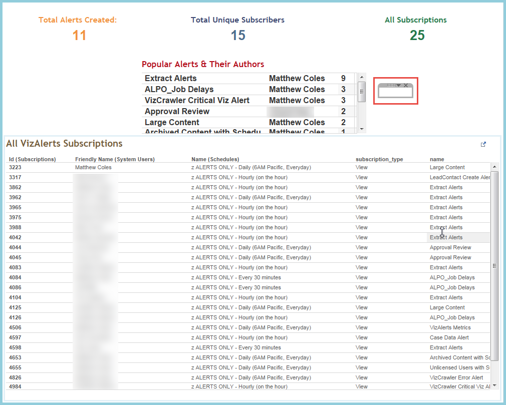

Now, just subscribe to the Dashboard just like any other Alert based on
a standard View, and you’re good to go!

### 

Testing an Alert
================

Occasionally, you may wish to test an alert prior to setting it up on a
Schedule, as you may not be certain it will execute properly. For
Advanced Alerts in particular, testing them first is highly recommended!
VizAlerts allows an alert to be tested on a one-off basis without being
scheduled through the use of a specific **comment**:

If the owner of the View adds a Comment with the content
“**test\_alert**” (case insensitive), then the Alert will be tested one
time only. If another comment with the same content is added, the Alert
will be tested again. Removing the comments, however, will not trigger
an additional test. Allow at least three minutes for your alert to show
up.

Note that this doesn’t work for Customized Views, only standard Views,
and the commenter must also be the owner.

FAQ / Common Issues / Troubleshooting 
=====================================

I got a failure email instead of an alert! 
------------------------------------------

When VizAlerts cannot process your alert, by default you and the
Administrator are sent a notification email with the details. Issues can
range from simple timeouts, permissions issues to datasources,
non-allowed destination email domains, bad custom view references, and
internal Tableau Server errors. The two most common errors are:

-   **Timeouts**  
    If timeouts are the case, improve the speed of your view! Read
    <http://www.tableausoftware.com/learn/whitepapers/designing-efficient-workbooks>
    and follow the instructions there. If that’s not possible, work with
    your Tableau Server Admin to find a way to increase the timeouts
    your alert runs under.

-   **Unable to Download Custom View**  
    If the custom view reference is causing failures then go to the
    desired view in Tableau Server, get the URL, and check it against
    the view reference in your Advanced Alerts trigger view. For example
    you might have set up a view reference like
    VIZ\_IMAGE(myDashboard/Quarterly Report) and the actual viewname is
    http://myServer/views/myDashboard/QuarterlyReport with no space
    in “QuarterlyReport”.

I’m getting Simple Alerts when I should be getting Email Advanced Alerts. 
-------------------------------------------------------------------------

The most likely reason is that there’s no **“Email Action”** field
present in your trigger view that has a value of 1. This is the key
field that indicates whether an alert is a Simple Alert or Advanced
Alert.

I’m getting Simple Alerts when I should be getting SMS Alerts 
-------------------------------------------------------------

The most likely reason is that there’s no **“SMS Action”** field present
in your trigger view that has a value of 1. This is the key field that
indicates whether an alert is a Simple Alert or advanced Alert

What if I don’t get an alert email when I expect one? 
-----------------------------------------------------

There are a couple of reasons this might occur:

1.  First, ensure that your filter criteria is set up correctly, and
    that you DID have data in your alert for when it was scheduled
    to run.

2.  Check to see if your alert was filtered and sent to Junk Mail rather
    than your Inbox. If it was, make sure to “always allow” mail from
    the address you received it from in your Junk Mail settings.

    1.  If it’s neither of those things, contact your Tableau Server
        administrator, as they should have received a failure email if
        your alert truly did not work correctly.

How can I avoid getting continual alerts for the same data? 
-----------------------------------------------------------

One strategy for this is to use a Relative Date filter against your
data. You should set that filter to a span of time that matches the
Schedule you subscribed to your Alert on. For example, if you have
subscribed to an Alert on a daily schedule, you should set your relative
date to show only data for the “Yesterday” relative date. It’s **almost
always preferable to check a previous static window of time**, such as
the previous day or previous hour, rather than the last N hours or
minutes. The reason for this is that your alert might not process the
exact same interval each time, and that can cause either duplicate
alerts, or missed alerts. If your alert runs hourly, on the hour, it may
actually run at five minutes’ past. If you simply check for a condition
that occurred in the *last* hour, you won’t miss any hours, and you
won’t overlap something you already checked.

Remember, you can implement these as true Tableau filters, or build them 
into the Email / SMS Action field calculation. In the VizAlerts data source 
in the VizAlertsDemo.twb workbook, there are several relative date filter 
calculations pre-built for you, so don't feel you need to re-invent the wheel! 

I’m getting my Alerts late. 
---------------------------

Discuss with your Admin, and if they aren’t sure what to do, ask them to
read the “FAQ” section of the install\_guide.docx file.

There is no default footer on my emails. 
----------------------------------------

If you’ve added the Email Footer field to your trigger view then that
overrides the VizAlerts default footer. You can add a calculated field
using the string “VIZALERTS\_FOOTER()” to put the default footer back
in, or build your own calculation.

My CSV is Bad! 
--------------

If you’ve ever tried to download a CSV of a Tableau dashboard you’ve
likely run into a situation where the data you got was not what you
expected to get…the same can occur with VIZ\_CSV content references.
There are two problems that can occur:

-   Wrong worksheet’s data

-   Wrong data structure (too many fields, measures are in multiple rows
    instead of multiple columns)

Here are workarounds for both:

### Wrong worksheet’s data

When we download a CSV from a Tableau dashboard (for example
VIZ\_CSV(myViz/myDashboard) Tableau pulls the data for the worksheet
that comes first when sorted alphanumerically. So to control which
worksheet gets downloaded first you can prepend the desired worksheet’s
name with a number or space character. For more information see ~~~link
to AndyK’s post.

### Wrong data structure

When downloading the CSV Tableau pulls *all* the pills used in the viz
and if we’ve used Measure Names/Measure Values generates a set of rows
for each of the measure names. To have more control over this the
solution for this is to build a separate worksheet with the fields that
we want as discrete pills on rows:

Don’t worry at all about formatting this viz, it’ll never be seen by the
user. Once you’ve built this, you have a few options for publishing this
worksheet for download:

-   Publish as a completely separate viz. This requires making sure that
    you have permissions properly configured.

-   Publish as an additional view in the workbook, give it an
    appropriate name, and then you’d reference it as something
    like VIZ\_CSV(myViz/DataForDownload). When using tabs this
    guarantees that you’ll have one extra tab, which is
    sometimes undesirable.

-   Publish as an invisible (and hidden) sheet in a dashboard. In this
    case you’d name the sheet using the tip above so that it is first in
    the alphanumeric sort order, Hide the worksheet, and make it
    invisible in the dashboard. There are two ways to make it invisible:

    -   Make the worksheet for download tiny and float some other
        element over the worksheet.

    -   Float the worksheet for download and then place it outside the
        borders of dashboard.

> Then when VIZ\_CSV(myViz/myDashboard) is called the worksheet for
> download will be the one referenced, and the data will be in the
> desired format.

My Emails aren’t Consolidating. 
-------------------------------

The **Consolidate Lines** field has to be present in your trigger view. In
addition each set of rows that you want to consolidate must have the
same Subject, From, To, CC, and BCC fields. Make sure there aren’t any
leading or trailing spaces that are causing the values of those to be
subtly (and perhaps invisibly) different.

My PDFs aren’t Merging. 
-----------------------

If the PDFs aren’t merging then you need to check each VIZ\_PDF()
content reference to make sure each includes both the following
arguments:

-   **|filename=\[filename\]** where all the \[filename\] references are
    the same

-   **|mergepdf**

Inline and/or Appended Attachments aren’t showing up in my email. 
-----------------------------------------------------------------

There are a couple of tests you can run here:

1.  Try running the VizAlertsDemo tests and see if they work. If they
    do, then your content references are incorrect in some way and need
    to be checked.

2.  If the attachment tests for the VizAlertsDemo aren’t showing up in
    your email, then try checking your email via a different application
    or device, and try running the tests again to a different email
    address on a different server. VizAlerts has been tested on a
    variety of applications and devices (Exchange Server, Apple Mail,
    iPhones, web browser, Outlook, etc.) but may be missing yours. If
    you are still having issues with certain application/device
    combinations then please submit a bug at
    <https://github.com/tableau/VizAlerts>.

The URL Parameters I’m using in my content references aren’t filtering the data properly.
-----------------------------------------------------------------------------------------

If your data has commas in it, e.g.
VIZ\_IMAGE(myworkbook/myview/?Manager=**Coles,Matt**), Tableau Server
will interpret that as Manager=(Coles OR Matt). The workaround for this
is to strip the comma from your data, and pass the cleansed value into
your filter. See [this
thread](https://community.tableau.com/thread/220471) for more
information.

Getting VizAlerts Help 
======================

First of all, check with your local Tableau Server Admin and any local
documentation that might exist. After that, the center for all things
VizAlerts is the VizAlerts Group on the Tableau Community
<https://community.tableau.com/groups/tableau-server-email-alert-testing-feedbac>.

Contributing to VizAlerts 
=========================

VizAlerts is an open source project distributed under the MIT License.
If you’d like to contribute ideas or code to VizAlerts, please visit the
VizAlerts GitHub site at <https://github.com/tableau/VizAlerts>.

[1] \* VizAlerts *does* have the ability to consolidate
multiple rows of data into one email. See [Consolidated Alerts](#consolidated_alerts)
