Tableau – VizAlerts Installation Guide

What is VizAlerts?
==================

VizAlerts is an automation platform intended to seamlessly integrate
with Tableau Server. The idea behind it is that **anyone** should be
able to easily build, share, and customize nearly **any** any email or
SMS **automation** based on their own Tableau Server viz data. In the
future, VizAlerts will be able to perform even more actions than these.

In its current form, VizAlerts exists simply as a Python script that is
set up by a system administrator to run at frequent and regular
intervals. All of the information it needs to enable data-driven email
and SMS alerting is derived from the Tableau Server PostgreSQL
repository, and the published views of the Tableau Server it is set to
run against.

What does it do?
================

VizAlerts has been designed to support many use cases:

-   Sending notifications to subscribers when a condition has been met
    (or not!) like extract refresh failures, meeting or missing target
    thresholds, etc.

-   Halting emails from being sent to the group unless the data is up to
    date (while the workbook owner does get an email that the data isn’t
    up to date).

-   Notify data owners when data is corrupt in some way (extraneous
    values, too many Null values, too large a change, etc.)

-   Sending a one line email notification that could be forwarded
    through an email-to-sms gateway such as \#\#\#\#\#\#\#\#@txt.att.net
    or a messaging provider such as Twilio.

-   Batch reporting to distribution lists of non-Tableau users, for
    example emailing a weekly operations report to front-line staff who
    aren’t on Tableau.

-   Combining images and text into an HTML email for a more customized,
    professional look.

-   Merge multiple views into a single consolidated PDF, for example
    sending a company overview and per-region detail.

-   Blend views from separate workbooks in the same email, for example a
    view from the operations dashboard and a view from the
    finance dashboard.

-   Bursting reports, for example sending to a manager a dashboard for
    each of her direct reports.

-   Send SMS messages to escalate an issue to your support staff.

-   Whatever combinations of the above you can imagine!

How does it work?
=================

While the details on how to *set up* alerts will be left in the User
Guide, it’s important for Administrators to know how things are working
behind the scenes.

The general flow of a single execution of VizAlerts goes like this:

1.  Connect to the PostgreSQL repository database of Tableau Server, and
    query it for a list of Views subscribed to on specially configured,
    disabled Schedules

2.  Compare Schedule information to last runtime information stored in a
    local text file—based on this, determine which Views are due for
    alert testing

3.  For each View found due for testing:

    1.  Generate a Trusted Ticket on behalf of the Subscriber of the
        View

    2.  Redeem the Trusted Ticket to export the CSV data for the View,
        impersonating the Subscriber

    3.  If one or more rows are found in the CSV:

        1.  For a “Simple Alert”, generate a new Trusted Ticket, export
            the PNG of the View, and email it to the Subscriber.

        2.  For an “Advanced Alert”, iterate through each row of the
            CSV, sending emails or performing other actions as
            instructed by the data itself.

**Changes in VizAlerts
2.0**

**VizAlerts 2.0 (released November 2016) has the following new and
changed features:**

**Improved Administration**

Most of the administrator configuration in VizAlerts is now handled by
editing a view on Tableau Server, rather than in the yaml file. This
change means that you’ll now have nearly unlimited flexibility in
defining alert restrictions.

Added config options around SSL certificate validation

**Easier Advanced Alert Configuration**

The fields used in Advanced Alerts no longer need to be exact! “Email To
\*, “Email To”, or “Email To Two 2” will all be recognized as containing
the To email addresses.

This also means you can set up alerts with different content using a
single datasource, simply by copying the fields and changing the names
for use in a different sheet.

**Faster**

VizAlerts is now multi-threaded, which allows it to gracefully scale to
process large numbers of alerts in a timely fashion. Scale it up to
however much your Tableau Server can handle.

**SMS support**

VizAlerts is no longer restrained to just sending email! It can now use
the Twilio service to send SMS messages.

These are configured in an Advanced Alert with the new “SMS Action”
fields. These can be used separately from the Email fields, or together
if you wish to send both an email *and* an SMS.

Upgrading from VizAlerts 1.0.0 or 1.1
=====================================

Here are instructions on how to upgrade from VizAlerts 1.x to VizAlerts
2.0:

1.  Check the Installation Prerequisites below, the major change is that
    you will need Tableau Desktop Professional available in order to
    complete the installation.

2.  Backup your VizAlerts 1.x directory.

3.  In Task Scheduler disable the existing VizAlerts scheduled task.

4.  Download version 2 from GitHub
    <https://github.com/tableau/VizAlerts> and unzip to a temporary
    location alongside your existing VizAlerts folder.

5.  Install the two new Python packages:

    1.  *pip install twilio*

    2.  *pip install phonenumberslite* blah

6.  Follow the instructions in the Installation section for:

    1.  Open the ScheduledTriggerViews Viz.

    2.  Configure the ScheduledTriggerViews Viz.

    3.  Publish the ScheduledTriggerViews Viz.  
          
        You will likely need to look at your existing 1.x settsings in
        the …\\\[VizAlerts 1.x folder\]\\config\\vizalerts.yaml file.

7.  Use a text editor (ideally with a diff function) to migrate the
    existing 1.x settings in the …\\\[VizAlerts 1.x
    folder\]\\config\\vizalerts.yaml to the new v2.0 vizalerts.yaml.  
      
    Note that many configuration options are now MISSING from the new
    yaml file because they are now in the ScheduledTriggerViews viz that
    you configured in step 5.  
      
    Migrate all your old setting wherever the same option remains in the
    new file.  
      
    Set the values for new settings:

    1.  server.user.domain (remove the domain name you used in the v1.x
        server.user and put it here instead).

    2.  If when publishing in step 5 above you changed the
        ScheduledTriggerViews site from default, workbook name, and/or
        view name then you will need to update the vizalerts.source.viz
        and vizalerts.viz.site, otherwise leave them as the default.

    3.  server.certfile : if you want to validate the SSL certificate
        for your Tableau Server, you’ll need to specify a path to the
        certificate bundle in .pem format.

    4.  SMS Settings : You can leave the defaults for right now if you
        don’t want to test SMS messaging at this point. If you have set
        up an account on Twilio then you can add that information here
        from your Twilio account page.

    5.  threads : **Two** is a safe number to start with. We recommend
        roughly **four** threads if you have 50+ active alerts running.

8.  Run VizAlerts from the command line in the v2.0 folder to verify
    that it runs without error.

9.  Run a test\_alert from an existing Tableau view, then run VizAlerts
    v2.0 from the command line to verify that it is able to deliver
    messages as before.

10. In Task Scheduler edit the VizAlerts task Action to point to your
    new v2.0 folder and enable the task.

**Installation
Prerequisites**

Tableau Server
--------------

The Tableau Server instance that you wish to run VizAlerts against must
fulfill the following requirements:

-   Must be v8.3 or higher.

-   The [readonly
    user](http://onlinehelp.tableau.com/current/server/en-us/adminview_postgres_access.htm)
    must be granted access on the Tableau Server repository.

-   [Subscriptions](http://onlinehelp.tableau.com/current/server/en-us/subscribe.htm)
    must be enabled.

-   The host you plan to run VizAlerts from must have its IP address
    listed as a [Trusted
    Host](http://onlinehelp.tableau.com/current/server/en-us/trusted_auth_trustIP.htm)

-   If it wasn’t already obvious, you need to be a System Administrator
    on Tableau Server to set all this up.

-   A Project configured with appropriate (usually very limited)
    permissions for the VizAlerts schedule viz. The VizAlerts schedule
    viz pulls information from the Tableau Server repository (using the
    readonly user) and can be configured in a number of ways so in
    general you’ll want to limit access to the VizAlerts
    system administrator(s).

Tableau Desktop
---------------

To install VizAlerts you’ll need to use Tableau Desktop Professional
once to publish the VizAlerts scheduled trigger viz. Here are the
requirements:

-   A version of Tableau Desktop appropriate to the Tableau Server
    version you are installing to. See
    <http://kb.tableau.com/articles/knowledgebase/desktop-and-server-compatibility>.
    If you don’t have Tableau Desktop or access to someone’s computer
    where you could use it then you can download a trial vesion of
    Tableau Desktop Professional from <http://tableau.com>.

-   The machine that is running Tableau Desktop will need to have a
    PostgreSQL driver installed, if you need one you can download it
    from <http://www.tableau.com/support/drivers>.

-   You’ll also need to make sure you can access the Tableau Server from
    your Tableau Desktop machine, you may need to open one or more
    firewalls to enable connection to Tableau Server and/or the
    PostgreSQL repository.

-   The machine where Tableau Desktop is located will need access to the
    …\\VizAlerts\\config\\ScheduledTriggerView.twb in order to
    publish it.

Host Machine
------------

This is where VizAlerts will be run from, which means that this machine
must be continually up and running for VizAlerts to function. This can
be one of the Tableau Server hosts if desired, but it doesn’t have to
be. It must have the following properties:

-   Static IP address

-   Always running

-   Within same domain as Tableau Server

-   You must have administrative rights to it

-   Should **not** need to have much processing power as heavy work is
    offloaded to Tableau Server

VizAlerts has been built and tested on Windows, but it’s also been known
to run on Linux and Mac.

  
SMTP (Mail) Server
------------------

VizAlerts needs to point to a mail server to send email. This can simply
be the same server you used when you set up Tableau Server for
subscriptions. If your mail server is set up to support SSL encryption,
that is ideal, but it’s not required.

Installation
============

You’ve got everything you need, now let’s get this thing running!

Configure Tableau Server
------------------------

Making any of these configuration changes requires a restart of Tableau
Server, so if this is being done on a live / production server, make
sure to do this during a maintenance window.

### Trusted Tickets 

VizAlerts uses [Trusted
Authentication](http://onlinehelp.tableau.com/current/server/en-us/trusted_auth.htm)
to impersonate users and obtain access to Tableau Server views in CSV
and PNG format. To grant it this access, run the following command at a
command prompt on the Primary host of Tableau Server:

tabadmin set wgserver.trusted\_hosts &lt;HOSTNAME OF VIZALERTS HOST&gt;

### Repository Access

The Tableau Server repository database contains information VizAlerts
needs to function. Grant it access by enabling the [readonly
user](http://onlinehelp.tableau.com/current/server/en-us/adminview_postgres_access.htm):

tabadmin dbpass --username readonly &lt;YOUR PASSWORD&gt;

### Restart

Once you have finished the above steps, you must save the configuration
and restart Tableau Server. When you’re ready to do this, run the
following commands in the command prompt:

tabadmin configure

tabadmin restart

### Custom Subscription Schedules

A key component that allows VizAlerts to work in the intuitive way that
it does is that users who wish to schedule an alert are able to
subscribe to them on *disabled* Subscriptions schedules. These are
schedules that you must create in Tableau Server, then manually disable
so that no subscriptions are ever delivered for them. Since the data for
who subscribed to what views *on* these specific schedules exists in the
PostgreSQL repository, VizAlerts can use this information to tell itself
when it is appropriate to test those views for an alert condition.

You can create as many schedules as you like, on whatever intervals you
like. The important bit behind the schedules is the **naming
convention** that you use, because this is how VizAlerts knows which
schedules to consider “alert” schedules that it needs to pay attention
to. I recommend naming them like this:

ѴizAlerts – \[frequency\]

**Copy and paste that** when you create your schedules—the first letter
is actually the Cyrillic letter Ѵ, which will cause your Alerts
schedules to be sorted at the bottom of the list when someone goes to
subscribe. This can help users avoid subscribing to them by mistake when
they only mean to set up a standard subscription:

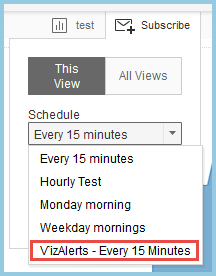

Note that you must have at least one **enabled** Subscriptions schedule
for anyone to subscribe to a viz on Tableau Server, so if you have just
enabled Subscriptions for the first time, you’ll also need to create a
single non-VizAlert schedule that isn’t disabled.

Create your new schedules like so:

­­­­­­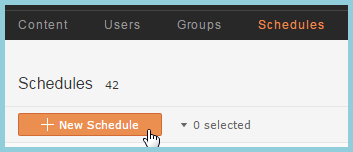

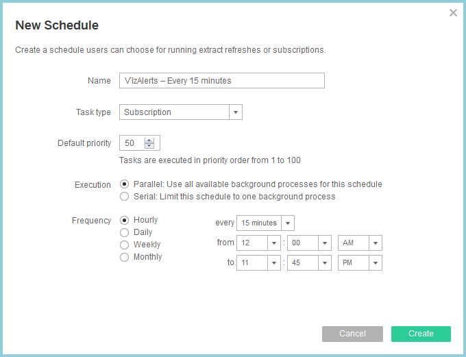

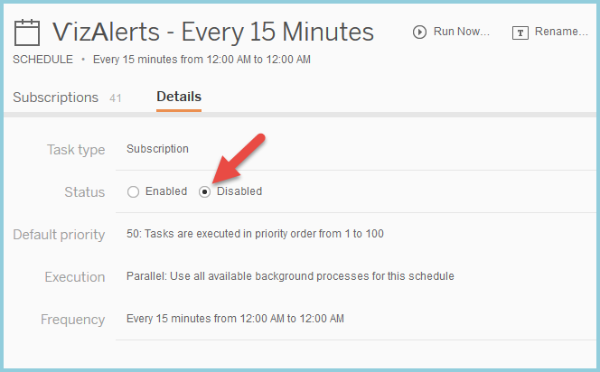

Open the VizAlertsConfig Workbook
---------------------------------

VizAlerts gets the list of alerts that users want to run, and when they
should run, from Tableau Server’s own PostgreSQL repository database.
The way it accesses that information is through a Tableau workbook that
you’ll publish to Tableau Server. For this step you’ll need the instance
of Tableau Desktop. To publish the viz, do the following:

1.  Open Tableau Desktop.

2.  Open the …\\VizAlerts\\config\\VizAlertsConfig.twb workbook.

3.  You’ll get a prompt about Custom SQL. You can review the SQL if you
    like, then press “Yes”.

4.  Depending on the Tableau Desktop version, you may get a prompt about
    the workbook being newer. Press OK to continue. You will get a login
    prompt that looks like this:  
      
    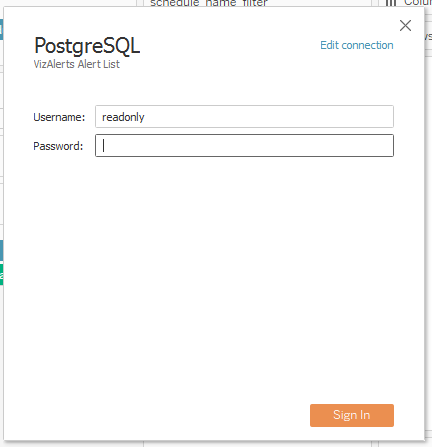

5.  Click Edit connection. The dialog will change to this dialog:  
    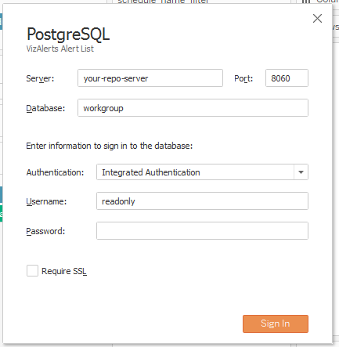

6.  Enter the following information:

    1.  Server: your Tableau Server domain name

    2.  Port: the port for the PostgreSQL repository, default is 8060

    3.  Database: leave as workgroup

    4.  Authentication: Change to Username and Password.

    5.  Username: leave as readonly

    6.  Password: enter the readonly password that you
        previously configured.

    7.  Require SSL: check this box if you are requiring SSL to connect
        to the Tableau repository.

7.  Click Sign In to sign in.

8.  The Tableau view that appears looks like this:

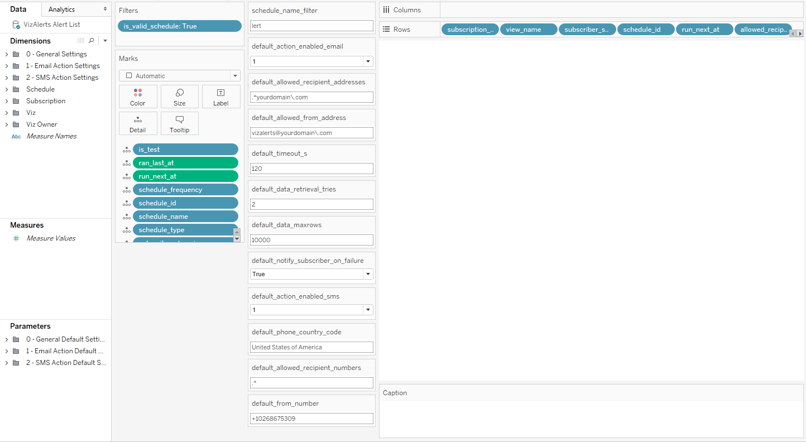

Configure the VizAlerts ScheduledTriggerView Viz
------------------------------------------------

The scheduled trigger view will initially show as empty because we
haven’t yet set up any VizAlerts. The main reason that a Tableau
workbook is used to tell VizAlerts what to do, is that it gives the
Admin a lot of flexibility in deciding which alerts should be processed
and *how* they should be processed. There are a number of parameters and
calculated fields that can be used to create a high degree of
customization, which we’ll talk about in a second, but to keep things
simple, there are only two settings that you **must** edit to get
started:

Substitute your own email domain name where you see “yourdomain” in both
fields. For example:

-   .\*tableau\\.com (only allows email to be sent to tableau.com
    addresses)  
    and…

-   vizalerts@tableau\\.com (only allows “from” address to
    be “vizalerts@tableau.com”)

If you’re just trying to get things up and running, skip to [Publish the
ScheduledTriggerViews Viz](#_Publish_the_ScheduledTriggerViews)

Here’s a list of the major calculated fields and the (default)
parameters associated with them:

| **General Settings**            |                                          |                                                                                                                                                                                             |
|---------------------------------|------------------------------------------|---------------------------------------------------------------------------------------------------------------------------------------------------------------------------------------------|
| **Calculated Field**            | **Parameter for default value**          | **Description**                                                                                                                                                                             |
| data\_retrieval\_tries          | default\_data\_retrieval\_tries          | The number of times VizAlerts will attempt to retrieve data for a particular viz before notifying of the failure.                                                                           |
| notify\_subscriber\_on\_failure | default\_notify\_subscriber\_on\_failure | When true (the default), the subscriber to the simple alert or the owner of the advanced alert is notified when there is a failure.                                                         |
| timeout\_s                      | default\_timeout\_s                      | The number of seconds allowed to download a visualization before Tableau will notify of a failure. This prevents overloading Tableau Server with visualizations that are too slow to render |
| viz\_data\_maxrows              | default\_data\_maxrows                   | The maximum number of alerts that can be sent at once.                                                                                                                                      |
| viz\_png\_height                |                                          | Sets the default height of downloaded images for Simple Alerts as well as the VIZ\_IMAGE() content reference.                                                                               |
| viz\_png\_width                 |                                          | Sets the default width of downloaded images for Simple Alerts as well as the VIZ\_IMAGE() content reference                                                                                 |

| **Email Action Settings**     |                                        |                                                                                                                                                                                                                                              |
|-------------------------------|----------------------------------------|----------------------------------------------------------------------------------------------------------------------------------------------------------------------------------------------------------------------------------------------|
| **Calculated Field**          | **Parameter for default value**        | **Description**                                                                                                                                                                                                                              |
| action\_enabled\_email        | default\_action\_enabled\_email        | Denotes whether alerts can send emails. 1 (the default) if email actions are supported, otherwise 0                                                                                                                                          |
| allowed\_from\_address        | default\_allowed\_from\_address        | The email address you wish all email alerts to be sent from. **Note** that for Advanced Alerts, this is used only if the author did not specify their own “from” address in their viz. **This uses Regex notation (see below for details).** |
| allowed\_recipient\_addresses | default\_allowed\_recipient\_addresses | The set of domains and addresses that email alerts can be sent to. **This uses Regex notation (see below for details).**                                                                                                                     |

| **SMS Action Settings**     |                                      |                                                                                                                                                                                           |
|-----------------------------|--------------------------------------|-------------------------------------------------------------------------------------------------------------------------------------------------------------------------------------------|
| **Calculated Field**        | **Parameter for default value**      | **Description**                                                                                                                                                                           |
| action\_enabled\_sms        | default\_action\_enabled\_sms        | 1 if SMS actions are supported, 0 (the default) if not.                                                                                                                                   |
| allowed\_recipient\_numbers | default\_allowed\_recipient\_numbers | The set of allowed recipient phone numbers (or partial numbers). **This uses Regex notation (see below for details)**.                                                                    |
| from\_number                | default\_from\_number                | The default number that SMS messages will originate from. This must be a number registered with Twilio that can do outbound SMS and be of the form +\[country code\]\[full phone number\] |
| phone\_country\_code        | default\_phone\_country\_code        | The default country code to use when recipient phone numbers do not have a country code.                                                                                                  |

| **Schedule Settings** |                                 |                                                                                         |
|-----------------------|---------------------------------|-----------------------------------------------------------------------------------------|
| **Calculated Field**  | **Parameter for default value** | **Description**                                                                         |
| is\_valid\_schedule   | schedule\_name\_filter          | Use to determine what Tableau Server subscription schedules will be checked for alerts. |

### Calculated Fields

The calculated fields such as action\_enabled\_email allow us to create
formulas inside Tableau to give us more fine-grained control. For
example, we can allow a specific user to send email to any address,
rather than use the default setting like so:

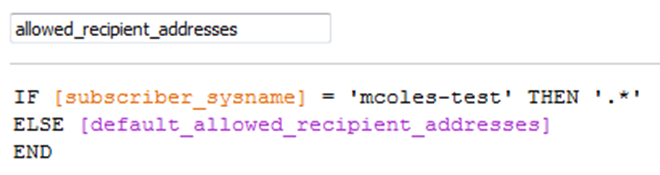

Translated, this simply means that if the user called “mcoles-test”
wants to email anyone in the world with VizAlerts, they can, but
everyone else’s email recipients will still be restricted to the pattern
you set for the default\_allowed\_recipient\_addresses parameter (e.g.,
only your company’s email addresses).

If you want to define even *more* extensive policies, well, that’s why
it’s a Tableau viz! You can build out that calculation further using
other criteria, or even blend or join other data sources to the original
connection. It allows for almost unlimited flexibility.

### Regex Notation

VizAlerts uses Regex Notation in setting the
**allowed\_recipient\_addresses**, **allowed\_recipient\_numbers**, and
**allowed\_from\_address** values for maximum flexibility. Each
individual email address a VizAlerts is attempting to send mail to
**must** match the pattern the administrator has defined in the
configuration viz. So this feature will allow you to define a set of
rules like these:

-   myfriendlyAOLuser@aol.com

-   mydomain.com

-   subdomain.someotherdomain.com

That would allow email to <jane@mydomain.com>,
<bob@subdomain.someotherdomain.com>, and <myfriendlyAOLuser@aol.com>
while denying email to addresses like <jerry@someotherdomain.com> and
<icanhazallyourdata@aol.com>.

A full explanation of what you can do with regex notation is beyond the
scope of this document, for more information about regex we suggest you
use <http://www.regular-expressions.info>. Here are the key elements:

-   .\* is the wildcard pattern to accept all characters.

-   If any of the following characters are used, they must have a \\
    preceding them to be accepted: \\^$.|?\*+()\[{  
      
    Example: If I want to accept all datablick.com addresses then the
    regex would be .\*datablick\\.com

-   Separate domains or email addresses are separated by the pipe |
    character.  
      
    Example: To accept all datablick.com and tableau.com addresses then
    the regex would be .\*datablick\\.com|.\*tableau\\.com

Publish the ScheduledTriggerViews Viz
--------------------------------------------------------------------------------------------------------------------------------------------------------

Here’s how to publish the workbook:

1.  Go to Server-&gt;Publish Workbook… If you haven’t already signed in
    to Tableau Server and need to, you’ll be prompted to sign in. Once
    you’ve signed in the Publish Workbook dialog will appear:  
      
    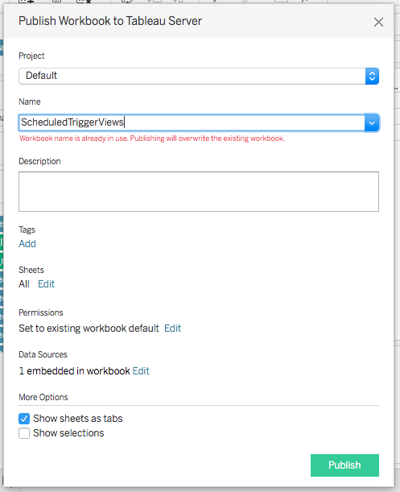

2.  Change the Project and/or Name of the viz if you want, if you change
    the Name you’ll need to record this to use in the next section.

3.  Change the Permissions if need be. **Only Administrators should have
    rights to alter this workbook.**

4.  Under Data Sources click Edit. The Manage Data Sources dialog will
    appear:  
      
    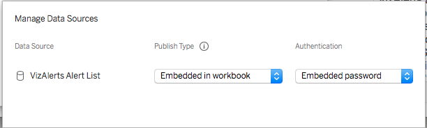

5.  Set the Publish Type to Embedded in workbook.

6.  Set the Authentication to Embedded password.

7.  Click outside of the dialog to close it.

8.  Click Publish. Tableau will now publish the viz and open it in your
    default web browser:  
    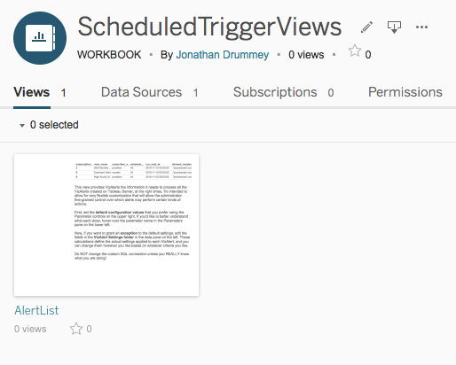

9.  Click on the view to verify that it works as expected.

10. You can now close the browser window and Tableau Desktop.

Install Python & Required Modules  
-----------------------------------

1.  On the Windows host you want to run VizAlerts from, download and
    install Python 2.7. This can be done in multiple ways, but we
    suggest this MSI installer:
    <https://www.python.org/ftp/python/2.7.9/python-2.7.9.msi>

2.  Add ";C:\\Python27\\;C:\\Python27\\Scripts\\" to your Path
    environment variable (assuming you chose the installation defaults
    when installing Python)

3.  Install the following Python modules:

    1.  [PyYAML](http://pyyaml.org/) (recommended:
        <http://pyyaml.org/download/pyyaml/PyYAML-3.11.win32-py2.7.exe> )

    2.  [psycopg2](http://www.stickpeople.com/projects/python/win-psycopg/)
        (recommended Windows port:
        <http://www.stickpeople.com/projects/python/win-psycopg/2.6.0/psycopg2-2.6.0.win32-py2.7-pg9.4.1-release.exe> )

    3.  The final five modules,
        [requests](http://docs.python-requests.org/en/latest/user/install/#install),
        [requests\_ntlm](https://github.com/requests/requests-ntlm/),
        [pypdf2](https://github.com/mstamy2/PyPDF2),
        [twilio](https://pypi.python.org/pypi/twilio), and
        [phonenumberslite](https://pypi.python.org/pypi/phonenumberslite),
        are best installed by opening a *new* command prompt and running
        the following commands:  
          
        *pip install requests  
        pip install requests\_ntlm  
        pip install pypdf2  
        pip install twilio  
        pip install phonenumberslite  
        *  
        If your computer does not have access to the Internet, see
        [Appendix A](#_Appendix_A).

    4.  **Note**: Despite the requirement to install the last two
        modules, deciding whether to *enable* the Twilio SMS integration
        feature is up to you—either at the environment level, or at more
        flexible sub-levels. Enabling the Twilio SMS integration
        requires a Twilio account (free accounts are available).  
          
        Also, please also note that it’s possible to send SMS messages
        *without* Twilio, as short email messages to subscribers who’s
        mobile network providers have an email-to-SMS gateway available.
        For example, <xxxxxxxxxx@txt.att.net> works in the USA. See the
        SMS Actions section of the VizAlerts User Guide for
        more details.

Configure VizAlerts
-------------------

Now that Python is installed, we can configure VizAlerts. Unzip the
VizAlerts.zip file to a folder of your choosing. For the purposes of
this manual, we’ll assume the files were extracted to C:\\VizAlerts.

1.  The next task is to give VizAlerts all the information it needs to
    connect to our Tableau Server instance. Open the file
    C:\\VizAlerts\\config\\vizalerts.yaml in a text editor. Each of the
    configuration settings in that file are commented to explain what
    they do, but we’ll go over the most important ones here:

| **Email Settings** |                                                                                                                                                                                         |
|--------------------|-----------------------------------------------------------------------------------------------------------------------------------------------------------------------------------------|
| smtp.serv          | This is the name of your SMTP server.                                                                                                                                                   |
| smtp.address.from  | The email address you wish all email alerts to be sent from. **Note** that for Advanced Alerts, this is used only if the author did not specify their own “from” address in their viz.  |
| smtp.address.to    | When an alert fails to run, failure details will be sent to this address along with the Subscriber, so it makes the most sense to use your own address or Admin distribution list here. |
| smtp.ssl           | When true, VizAlerts will attempt to use SSL for email encryption (which your SMTP server must support). If you do not wish to use encryption, leave it “false”.                        |
| smtp.user          | Username for the account used to connect to your SMTP server. If no authentication is need, leave it “null”                                                                             |
| smtp.password      | Password for the account used to connect to your SMTP server. If no authentication is need, leave it “null”. The password must be enclosed in single quotes.                            
                                                                                                                                                                                                               
                      If desired, this value can be a valid path to a .txt file containing the password, e.g. 'c:\\users\\mcoles\\password.txt', rather than the password itself.                              |

| **Tableau Server Settings** |                                                                                                                                                   |
|-----------------------------|---------------------------------------------------------------------------------------------------------------------------------------------------|
| server                      | Name of the Tableau Server you wish to run this instance of VizAlerts against.                                                                    |
| server.version              | Major version of the Tableau Server you are running VizAlerts against (this must be 8, 9, or 10)                                                  |
| server.user                 | This is ANY user licensed in Tableau Server--it does not need to be an Admin, as it is only used in authenticating over HTTP.                     
                                                                                                                                                                                  
                               -   If you are using Active Directory authentication, prepend the domain name in front of the username, e.g. “tableau.com\\mcoles”                 
                                                                                                                                                                                  
                               -   If you are using Local Authentication, simply supply the username, e.g., “mcoles”                                                              |
| server.user.domain          | The Active Directory domain for the server.user account, leave as null if using local authentication.                                             |
| server.ssl                  | When set to true, use SSL to connect to Tableau Server (recommended if you have enabled SSL).                                                     |
| vizalerts.source.viz        | This identifies the VizAlerts scheduled alert viz. it must be of the form workbook/viewname. The publishing information for this viz will be used |
| vizalerts.source.site       | Identifies the Tableau Server site for the vizalerts.source.viz.                                                                                  |

| **Security Settings** |                                                                                                           |
|-----------------------|-----------------------------------------------------------------------------------------------------------|
| server.ssl            | When set to true, use SSL to connect to Tableau Server (recommended if you have enabled SSL).             |
| server.certcheck      | If using SSL then validate the certificate If set to true then you must also specify the server.certfile. |
| server.certfile       | Full path to the set of trusted CA certificates in .pem format                                            |

| **SMS Action Settings** |                                                                                                                                    |
|-------------------------|------------------------------------------------------------------------------------------------------------------------------------|
| smsaction.enable        | Set to True to enable SMS Advanced Alerts to be sent. If set to False then all other smsaction fields are ignored. (Default False) |
| smsaction.provider      | The only supported provider at this time is twilio.                                                                                |
| smsaction.account\_id   | The account ID at the SMS provider.                                                                                                |
| smsaction.auth\_token   | Authorization token provided by the SMS provider.                                                                                  |

Testing
-------

Whew! All that was lots of fun, but let’s get to the good stuff and test
this thing to see if we did everything right. We’ve got a few tests to
run to validate that everything is working, starting out from simple to
more complicated:

### Can VizAlerts Connect? Test

Run the following from a command prompt on the Windows host you set
VizAlerts up on. By default, VizAlerts will expect you are running it
within the context of the directory you created it in, so change to that
directory first, then run the script:

cd C:\\VizAlerts

python C:\\VizAlerts\\vizalerts.py

It should have successfully generated a Trusted Ticket, queried the
PostgreSQL database in Tableau Server, then realized there was nothing
to do and quit without error. If it didn’t, please see the [Common
Errors](#_Common_Errors:) section.

### Simple Alert Test

Now for a more extensive test on a Simple Alert. Subscribe to any
Tableau Server View on a VizAlerts schedule that you set up (pick a view
that renders in less than 10 seconds or so). We recommend subscribing on
a VizAlerts schedule that runs every 15 minutes for this test, even if
you just remove it afterward. After you subscribe, run the command
again:

python C:\\VizAlerts\\vizalerts.py

Now, wait 15 minutes, then run the same command again. If data is
present in the viz, you should receive an email! If not, you shouldn’t.
Simple as that!

### Put VizAlerts Through Its Paces Test

For this test you are going to use the same Tableau workbook that the
VizAlerts contributors use to verify VizAlerts is working after we’ve
changed the code. Note that this workbook only works with Tableau
version 9.0 and up.

1.  In Tableau Desktop open \[VizAlerts
    Install Folder\]\\VizAlerts\\demo\\VizAlertsDemo.twb.

2.  Go to the Advanced Alerts view and set the VizAlerts From Email and
    VizAlerts To Email parameters to your test email address:  
    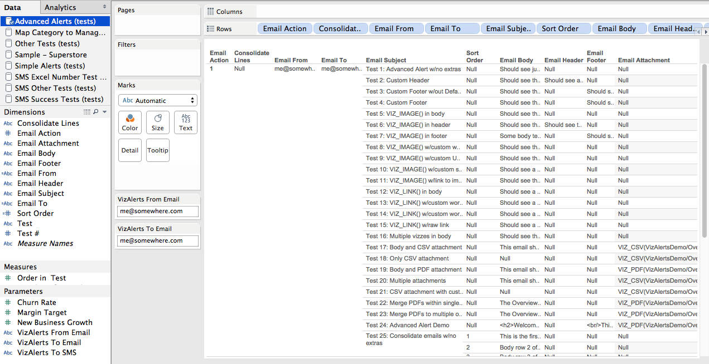

3.  Choose Server-&gt;Publish workbook… to start the publishing process.
    Use the default settings, which will include the External Files
    option:  
      
    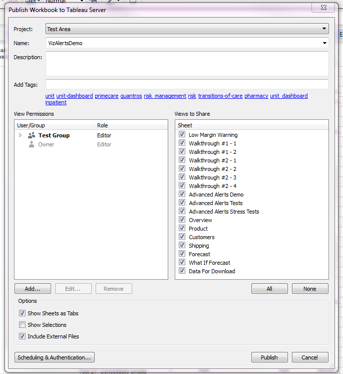  
      
    We suggest you publish the workbook in a place where other users who
    will be configuring Advanced Alerts (see the User Guide) can see
    the workbook.

4.  Click through the warning(s) about including external files and
    publish the workbook.

5.  If you’re on Tableau v10 or higher you can skip this step. When the
    confirmation window appears, click Open in browser window to open
    the VizAlertsDemo workbook on Tableau Server.  
    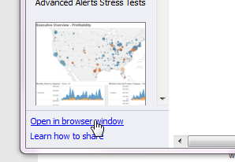

6.  Login to Tableau Server if you need to and navigate to the Advanced
    Alerts Demo worksheet.

7.  Scroll down in the worksheet and enter a comment with the
    text “test\_alert”.

8.  After the comment has been posted, go back to your Windows command
    prompt and enter:  
      
    python C:\\VizAlerts\\vizalerts.py  
      
    If the script runs and exits the first time without processing
    anything, run it again. (Tableau can take a moment to update the
    data with the “test\_alert” comment that acts as a trigger).
    VizAlerts will now generate 30+ emails with a variety of tests
    demonstrating the VizAlerts features. Read through the emails to
    understand what is expected of each. If you get any error messages
    then check the Common Errors section below as well as the FAQ in the
    User Guide.

### Optional: Send Yourself Some SMS Messages Test

If you have set up the integration with Twilio now’s the time to see if
it works, you’ll be using the same testing workbook from the prior demo.
that the VizAlerts contributors use. Note that this workbook only works
with Tableau version 9.0 and up.

1.  In Tableau Desktop open \[VizAlerts
    Install Folder\]\\VizAlerts\\demo\\VizAlertsDemo.twb.

2.  Go to the SMS Success Tests view and set the VizAlerts To SMS
    parameter to your test SMS phone number:  
      
    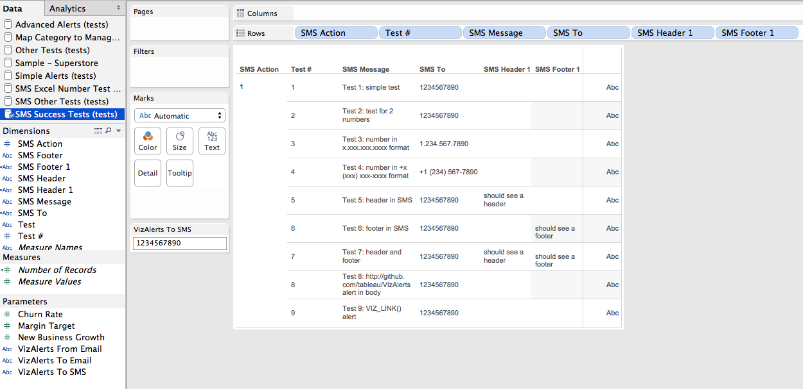

3.  Choose Server-&gt;Publish workbook… to start the publishing process.
    Use the default settings, which will include the External Files
    option:  
      
    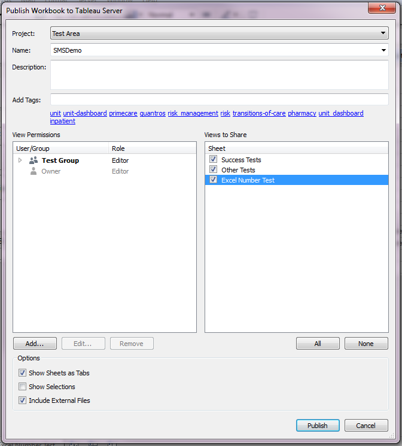

4.  Click through the warning(s) about including external files and
    publish the workbook.

5.  If you’re on Tableau v10 you can skip this step. When the
    confirmation window appears, click Open in browser window to open
    the VizAlertsDemo workbook on Tableau Server.

6.  Login to Tableau Server if you need to and navigate to the SMS
    Success Tests worksheet.

7.  Scroll down in the worksheet and enter a comment with the
    text “test\_alert”.

8.  After the comment has been posted, go back to your Windows command
    prompt and enter:  
      
    python C:\\VizAlerts\\vizalerts.py  
      
    If the script runs and exits the first time without processing
    anything, run it again. (Tableau can take a moment to update the
    data with the “test\_alert” comment that acts as a trigger).
    VizAlerts will now generate 10 SMS message with a variety of tests
    demonstrating the VizAlerts features. Read through the messages to
    understand what is expected of each. If you get any error messages
    (which will be delivered by email) then check the Common Errors
    section below as well as the FAQ in the User Guide.

Final Steps
-----------

### Set up a Scheduled Task

The last step, now that everything is working as expected, is to
automate this so that VizAlerts can run regularly when it is supposed
to. To do this, we need to set up a Scheduled Task on the Windows host
that VizAlerts runs from, which will run this for us on a regular basis.

First, let’s create a new Task:

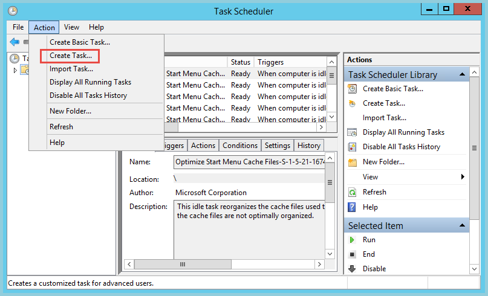

Fill in the name and description. Make sure it will run whether the user
is logged in or not. The task should be set up to run under a service
account rather than a personal one, if possible. This account must have
full control permissions on the VizAlerts files, and if you specified
text files instead of passwords in the vizalerts.yaml config file, the
account will need rights to read those files.

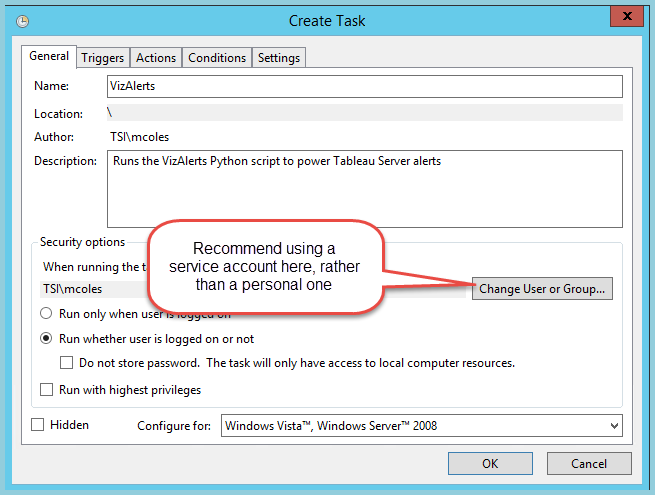

Set up the Trigger (when will it run?). We strongly recommend running
this every **1 minute**, as this will keep alerts executing on time, and
the vast majority of executions will be quick checks that don’t actually
do any work:

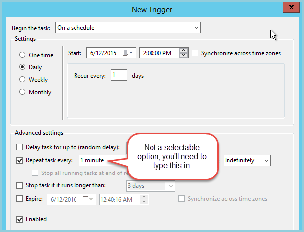

Set the Action on the Task (what will it do?)

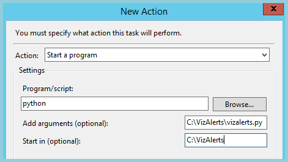

And save the task! You can now test out task by subscribing the
VizAlertsDemo/AdvancedAlertsDemo view to a subscription and look for an
email.

### Helper Datasource

Last, but not least, publish the \[VizAlerts install
folder\]\\demo\\VizAlerts.tdsx data source to Tableau Tableau Server,
and grant permissions to anyone you wish to have an easier way to create
Advanced Alerts. This datasource simply gives users a shortcut to
creating them (see the User Guide for more details).

### 

FAQ
===

-   **How many alerts can be run at once?  
    **Alerts are processed in parallel, according to the number of
    threads you set in the config\\vizalerts.yaml file. They are checked
    according to the Schedule they are associated with, in order of the
    “priority” field in the config workbook. Here’s an example: Alerts
    scheduled for 6:00AM will begin being checked at 6:00AM. If you’re
    running two threads and have three alerts to process then the two
    alerts with the lowest priority settings will be checked first. If
    those two alerts take five minutes each to process then the third
    alert wouldn’t be start to be processed until 6:05am. So two things
    to pay attention to are how long it takes alerts to process (which
    you can see in the VizAlerts logs), the timeout settings (since
    long-running alerts could be caused by a large volume of actions
    and/or views that are slow to render), and the number of alerts that
    are simultaneously scheduled.

-   **Does VizAlerts use a database to log information about what it has
    done?  
    **No, not in its current state, though this is the next logical
    progression for it. Currently it logs information into text
    files only.

Common Errors
=============================================================================================================

This section mostly focuses on errors found at installation time. Many
other common error situations are covered in the troubleshooting section
of the VizAlerts User Guide.

-   **Failed with unknown protocol**

    -   This likely means that you’ve enabled SSL in the vizalerts.yml,
        but haven’t set Tableau Server up for it. See [this
        portion](http://onlinehelp.tableau.com/current/server/en-us/ssl_config.htm)
        of the online help on how to do so.

-   **Parsing or yaml scanner errors**

    -   Generally this means that some bad character or formatting issue
        was introduced to the vizalerts.yml file (typically a tab
        character—replace them with spaces!). We recommend using this
        [online YAML validator](http://codebeautify.org/yaml-validator)
        to determine where the problem is (make sure to remove your
        passwords first!).

-   **Invalid regular expression found**

    -   If VizAlerts won’t start, and sends you an email with this
        message, it means one of two things:

        -   You live in an area where the default delimiter is another
            character besides commas, such as semicolon. To fix this,
            just open config\\vizalerts.yaml, and change the
            data.coldelimter to ‘;’ instead of ‘,’.

        -   One of the regular expressions in your VizAlertsConfig.twb
            fields is not correct. Test it out at <http://regexr.com/>
            to make sure it’s behaving.

-   **HTTP 406 error**

    -   You might see the following error: export\_view - HTTP error
        getting vizdata from url
        [http://\[your](http://[your) server\]/views/VizAlerts/AlertList?&amp;:format=csv&amp;:refresh=y.
        Code: 406 Reason: Not Acceptable  
          
        This would be due to not embedding the password for the readonly
        user into the ScheduledTriggerViews workbook.

    -   If you see a 406 on a standard VizAlert, it generally means that
        Tableau Server could not export the view for some reason. This
        could be due to a variety of causes:

        -   The subscriber does not have access to the view

        -   The view could not connect to its data source for some
            reason

        -   A Tableau Server process crashed when it tried to load the
            view

        -   The view had an invalid calculation and couldn’t be loaded

-   **Trusted ticket failure**

    -   Check to ensure your trusted tickets were [configured
        properly](http://onlinehelp.tableau.com/current/server/en-us/trusted_auth_trustIP.htm).
        If things are still not working, try [this
        article](http://kb.tableau.com/articles/knowledgebase/testing-trusted-authentication)
        to test them further.

    -   A “-1” result could be due to several possible issues. Please
        see [this
        article](http://onlinehelp.tableau.com/current/server/en-us/trusted_auth_trouble_1return.htm)
        if you’re seeing this error.

-   **Unable to export … as CSV**

    -   This means that the attempt to export the view data for an alert
        to a CSV file failed, either because of internal errors, or
        because it took longer than the timeout you’ve set in the
        config file. If the view can be rendered successfully in your
        browser, it may simply be taking too long. Increasing the
        timeout settings may help with this, but a better solution is to
        try and optimize the viz to render more quickly. By default, the
        settings use stricter timeouts on more frequently-run alerts, as
        it’s assumed they’ll have more opportunities to be retried.

-   **Exporting Views - Unable to write to folder**

    -   The Tableau Server “run as” user must have read/write
        permissions on any folders used for exporting views.

Getting VizAlerts Help
======================

First of all, check with any local admins and any local documentation
that might exist. After that, the center for all things VizAlerts is the
VizAlerts Group on the Tableau Community
<https://community.tableau.com/vizalerts>

Contributing to VizAlerts
=======================================================================================================================

VizAlerts is an open source project distributed under the MIT License.
If you’d like to contribute ideas or code to VizAlerts, please visit the
VizAlerts GitHub site at <https://github.com/tableau/VizAlerts>.

Appendix A
======================================================================================================

Installing Python modules with no Internet access
-------------------------------------------------

Setting VizAlerts up on a secure machine that isn’t connected to the
Internet can be done by following these instructions. It essentially
requires that you download the files that you need from a machine that
is connected to the Internet, then copy them over to the secured machine
you’ll be running VizAlerts from.

1.  First, download the Python [install file](#_Install_Python_&).
    Install it on the Internet-connected machine you’re using to
    download files, then copy it to your VizAlerts host and install
    Python there too. On both machines, you may wish to follow Step 2 as
    well, and add the Python executables to your PATH
    environment variable.

2.  From your Internet-connected machine, run the following commands to
    download all of the required Python modules (feel free to adjust the
    path they download to). These function as basically offline package
    repositories:

    *pip install --download c:\\mypythonpackages requests*

    *pip install --download c:\\mypythonpackages requests\_ntlm*

    *pip install --download c:\\mypythonpackages pypdf2*

    Optional packages for SMS messaging:

    *pip install --download c:\\mypythonpackages phonenumberslite*

    *pip install --download c:\\mypythonpackages twilio  
    *

3.  Copy the entire folder to your offline machine (I'm assuming here
    that it's copied to the same path).

4.  On your offline machine, install the package from the newly copied
    folder:

    *pip install --no-index --find-links file:c:\\mypythonpackages
    requests*

    *pip install --no-index --find-links file:c:\\mypythonpackages
    requests\_ntlm*

    *pip install --no-index --find-links file:c:\\mypythonpackages
    pypdf2 *

    Optional packages for SMS messaging:

    *pip install --no-index --find-links file:c:\\mypythonpackages
    phonenumberslite*

    *pip install --no-index --find-links file:c:\\mypythonpackages
    twilio  
    *

5.  Check for errors in the output. If there are none, you’ve
    successfully got Python and all the modules installed!

    *  
    *

